# 🗺️ עץ תרחיש מלא מעלה-למטה (Centered Vertical Single-Spine Flowchart)

תרחיש עץ יחיד, מאוזן וממורכז 100% במרכז המסך, במבנה **Mermaid Flowchart (Top-Down)** ללא נטייה/סחף ימינה, ללא התרחבות לצדדים וללא רשימות טקסט.

---

```mermaid
graph TD
    START["🎮 התחלה: מחקר קרקע על משחק חדש"] --> S0_1["🔎 סריקת בייטים ראשונים בארכיון"]
    S0_1 --> D_MAGIC{"🧩 האם חתימת הארכיון מוכרת?"}

    D_MAGIC -- "✅ כן" --> S0_2["🛡️ סקירת הגנות המשחק והגנות הגנה"]
    D_MAGIC -- "❌ לא" --> RECON["🛠️ פענוח והנדסה לאחור למכולה"]
    RECON --> D_MAGIC_RE{"האם הפענוח מדויק 100%?"}
    D_MAGIC_RE -- "❌ לא" --> NO_GO_CONTAINER["🛑 עצירה: קובץ הארכיון חסום"]
    D_MAGIC_RE -- "✅ כן" --> S0_2

    S0_2 --> D_DRM{"🔒 האם קיימת חסימת הגנה קשיחה?"}
    D_DRM -- "🟢 לא" --> S1["🎯 שלב 1: הוכחת תפריט ראשונית"]
    D_DRM -- "🔴 כן" --> NO_GO_DRM["🛑 עצירה: הגנת המשחק חוסמת"]

    S1 --> D_SLOT{"🌍 האם קיימת שפה ערבית במשחק?"}
    D_SLOT -- "✅ כן" --> AR_SLOT["🌍 חטיפת משבצת ערבית<br/>(כיווניות מנוע בחינם + קול אנגלי)"]
    D_SLOT -- "❌ לא" --> LTR_SLOT["⚙️ חטיפת משבצת אנגלית<br/>(אפיית כיווניות מראש)"]

    AR_SLOT --> PAYLOAD["📦 הרכבת מחרוזת הוכחה:<br/>סמני בדיקה + זוג מילים + 27 אותיות"]
    LTR_SLOT --> PAYLOAD

    PAYLOAD --> AUTOHOST["🤖 הפעלה אוטונומית שקטה ברקע"]
    AUTOHOST --> DXCAM["📸 צילום מסך אוטונומי ישיר"]
    DXCAM --> D_PROOF{"📸 תוצאת צילום המסך?"}

    D_PROOF -- "✅ עברית תקינה" --> S3["📚 שלב 3: הקורפוס ואורקל המגדר"]
    D_PROOF -- "🔲 ריבועים ריקים" --> S2["🔤 שלב 2: הזרקת פונטים וכיול טיפוגרפי"]
    D_PROOF -- "🪞 עברית הפוכה" --> L_BIDI["🔄 החלפת מצב אחסון (ישר ↔ הפוך)"]
    D_PROOF -- "⬜ מסך שחור" --> L_LOAD["🔄 בדיקת נתיב התקנה ותקינות קובץ"]

    L_BIDI --> PAYLOAD
    L_LOAD --> PAYLOAD

    S2 --> FONT_WORK["🛠️ הזרקת גליפים עבריים + תיקון גבולות"]
    FONT_WORK --> FONT_PREVIEW["🖼️ תצוגה מקדימה ללא הפעלת משחק"]
    FONT_PREVIEW --> D_FONT_OK{"🖼️ התצוגה נקייה מבאגים?"}
    D_FONT_OK -- "✅ כן" --> PAYLOAD
    D_FONT_OK -- "❌ לא" --> FIX_XOR["🛠️ תיקון מילוי צורות פנימיות"]
    FIX_XOR --> FONT_PREVIEW

    S3 --> PANEL["🧬 בניית פאנל עידן חדש (יישור 7-12 שפות)"]
    PANEL --> DEDUP_CHECK["⛔ איסור איחוד מחרוזות לפי אנגלית"]
    DEDUP_CHECK --> UPLOAD_POOL["🌐 העלאת כל הטקסט למאגר התרגום הקהילתי"]
    UPLOAD_POOL --> S4["🚁 שלב 4: צי בינה מלאכותית ומשגיחים"]

    S4 --> CLAIM["📥 משיכת תור שורות לתרגום עם הגבלת קצב"]
    CLAIM --> WATCHDOG["🐕 משגיח ריפוי עצמי:<br/>סגירת תהליך ➔ טעינה מחדש ➔ בדיקה"]
    WATCHDOG --> SPLIT["🚁 פיצול עבודה בין שרתי AI ודגמים מקומיים"]
    SPLIT --> GUARDS["🛡️ הגנות שורה אוטומטיות:<br/>שמירת תגים, משתנים וניקוד"]
    GUARDS --> D_GUARD{"❓ השורה עברה את ההגנות?"}

    D_GUARD -- "✅ כן" --> SAVE_LINE["💾 שמירה אטומית במסד הנתונים"]
    D_GUARD -- "🛠️ כשל מבני" --> FIX_DET["🛠️ תיקון אוטומטי ללא פסילה"]
    FIX_DET --> SAVE_LINE
    D_GUARD -- "❌ כשל תוכן" --> PARK["⏸️ העברה לבדיקת מנהל"]

    SAVE_LINE --> S5["🧪 שלב 5: ביקורת איכות לשונית"]
    S5 --> LQA_AGENTS["🔍 20 סוכני ביקורת ➔ 20 סוכני אימות"]
    LQA_AGENTS --> CONTENT_AUDIT["📊 בדיקת שלמות לפי תוכן עברי בפועל"]
    CONTENT_AUDIT --> PRE_WRAP["📐 עיטוף פסקאות מראש לפי רוחב אות"]
    PRE_WRAP --> D_LQA{"🧪 הכל נקי מבאגים וזליגות?"}

    D_LQA -- "✅ כן" --> S6["🌐 שלב 6: מחשוב קהילתי מאובטח"]
    D_LQA -- "❌ לא" --> L_RETRY["🔄 החזרת שורות פגומות לתרגום חוזר"]
    L_RETRY --> SPLIT

    S6 --> BYOK_RUN["📱 הרצת מחשוב קהילתי עם מפתחות מוצפנים"]
    BYOK_RUN --> RPC_SYNC["🔒 תקשורת מאובטחת מול השרת"]
    RPC_SYNC --> S7["🏗️ שלב 7: בנייה ופריסה נייטיב"]

    S7 --> BUILD_CLEAN["🏗️ בניית הארכיון מחדש מקובץ הגיבוי המקורי בלבד"]
    BUILD_CLEAN --> NATIVE_DEPLOY["🚀 התקנה נייטיב לתיקיית המשחק"]
    NATIVE_DEPLOY --> RE_READ_VERIFY["🔍 אימות עומק מקובצי המשחק הפרוסים"]
    RE_READ_VERIFY --> D_RE_READ{"🔍 האימות מקובצי המשחק עבר?"}

    D_RE_READ -- "✅ כן" --> SYNC_4["🔄 סנכרון מלא ב-4 משטחי השרת"]
    D_RE_READ -- "❌ לא" --> L_BUILD_FIX["🔄 תיקון הבילדר ובנייה חוזרת"]
    L_BUILD_FIX --> BUILD_CLEAN

    SYNC_4 --> D_USER_PUB{"🚦 המשתמש לחץ 'פרסם'?"}
    D_USER_PUB -- "🟢 כן" --> PUBLISH_LIVE["🚀 פרסום מלא בשרתי הענן"]
    D_USER_PUB -- "🔴 לא" --> LOCAL_ONLY["🏠 מותקן במחשב המקומי בלבד"]

    PUBLISH_LIVE --> S8["🔄 שלב 8: תחזוקה ועדכונים לאחר הפרסום"]
    S8 --> END["🎉 מוד עברי מושלם, מאומת 100% ופועל ללא באגים ותקלות!"]
```

