# 📘 תוכנית אב: ארכיטקטורת זרמי התרגום, הצי והביקורת (Master Blueprint)
## Game Translator Fleet & Review Engine

> **שפה:** עברית קלה, קצרה וקולעת  
> **מטרה:** תרחיש עץ הנדסי מלא מעלה-למטה המציג את כל שלבי הצי, פיצוח המכולות, Bidi, הזרקת הפונטים, אורקל המגדר, ביקורת LQA רב-סוכנית, מחשוב קהילתי (BYOK) וסנכרון 4 המשטחים לקראת פרסום.

---

## 📋 תוכן העניינים

1. [קטגוריה 1: הארכיטקטורה בקצרה](#1-קטגוריה-1-הארכיטקטורה-בקצרה)
2. [קטגוריה 2: פיצוח מכולות, Container Magic והגנות DRM](#2-קטגוריה-2-פיצוח-מכולות-container-magic-והגנות-drm)
3. [קטגוריה 3: הוכחת תפריט (Menu-Proof) וזיהוי Bidi](#3-קטגוריה-3-הוכחת-תפריט-menu-proof-וזיהוי-bidi)
4. [קטגוריה 4: הזרקת פונטים, AlignZones וכיול טיפוגרפי](#4-קטגוריה-4-הזרקת-פונטים-alignzones-וכיול-טיפוגרפי)
5. [קטגוריה 5: פאנל "עידן חדש" (New-Era Panel) ואורקל המגדר](#5-קטגוריה-5-פאנל-עידן-חדש-new-era-panel-ואורקל-המגדר)
6. [קטגוריה 6: צי התרגום הרב-ספקי (Fleet AI) וריפוי עצמי (Watchdogs)](#6-קטגוריה-6-צי-התרגום-הרב-ספקי-fleet-ai-וריפוי-עצמי-watchdogs)
7. [קטגוריה 7: מערך הביקורת וה-LQA הרב-סוכני (Multi-Agent Review)](#7-קטגוריה-7-מערך-הביקורת-וה-lqa-הרב-סוכני-multi-agent-review)
8. [קטגוריה 8: מחשוב קהילתי (BYOK), Supabase והגנות אבטחה](#8-קטגוריה-8-מחשוב-קהילתי-byok-supabase-והגנות-אבטחה)
9. [קטגוריה 9: 8 תרחישים ויזואליים עם חצים (Visual Scenarios)](#9-קטגוריה-9-8-תרחישים-ויזואליים-עם-חצים-visual-scenarios)
10. [קטגוריה 10: סיכום מנהלים קצר וטבלת השוואה מרכזית](#10-קטגוריה-10-סיכום-מנהלים-קצר-וטבלת-השוואה-מרכזית)

---

## 1. קטגוריה 1: הארכיטקטורה בקצרה

אנחנו מחברים 3 שכבות הנדסיות קריטיות למערכת תרגום וביקורת אוטונומית מקצה לקצה:

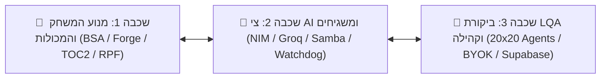

* **שכבה 1 (מנוע ומכולות):** פענוח והזרקה כירורגית (`bsa.py`, `forge.py`, `swf.py`, `rpf7.py`), ניהול Bidi וכיול פונטים.
* **שכבה 2 (צי AI וריפוי עצמי):** חלוקת עבודה בין 7-20 זרמי תרגום, הגנות דטרמיניסטיות ומשגיח (Watchdog) להתאוששות מתקלים.
* **שכבה 3 (ביקורת וסנכרון):** LQA רב-סוכני אדברסרי (20 Review ➔ 20 Verify), פורטל `/translate`, מחשוב קהילתי וסנכרון 4 המשטחים.

---

## 2. קטגוריה 2: פיצוח מכולות, Container Magic והגנות DRM

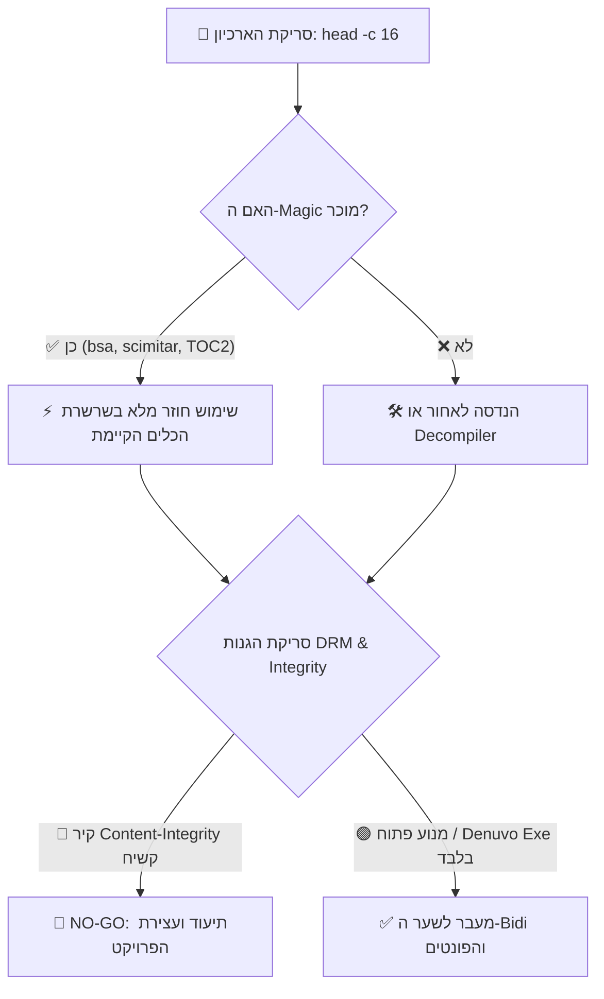

1. **שימוש חוזר ב-Magic (Magic Reuse):** בדיקת הבית הראשון בארכיון חוסכת שבועות של עבודה.
2. **סינון DRM מוקדם:** זיהוי Denuvo, VMProtect (`.vmp0`), EAC וספירת חתימות SHA-256 למניעת dead-ends.
3. **מיפוי משטחי הטקסט:** הפרדה בין ממשק משתמש (UI), דיאלוגים (`.ILSTRINGS`), ספרים (`.DLSTRINGS`) וכתוביות.

---

## 3. קטגוריה 3: הוכחת תפריט (Menu-Proof) וזיהוי Bidi

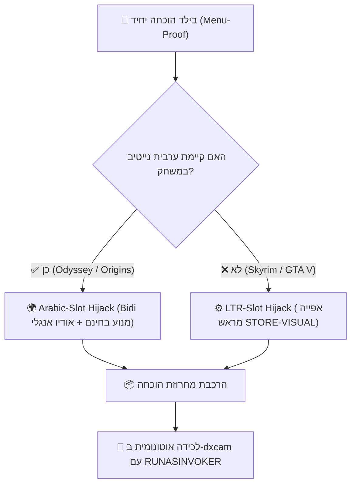

1. **חטיפת משבצת שפה (Hijack Slot):** שימוש במשבצת ערבית ל-Bidi מנוע בחינם, או משבצת אנגלית עם אפיית **STORE-VISUAL**.
2. **מרקר לטיני `ZZ-OK-ZZ`:** מבדיל מיידית בין קובץ שלא נטען לבין פונט ללא גליפים.
3. **זוג A/B מנצח:** הרצת אותה מילה ב-LOGICAL וב-VISUAL על אותו מסך — רק אחת תיקרא נכון.
4. **לכידה אוטונומית שקטה (`dxcam`):** הפעלת המשחק ברקע, עקיפת סרטוני פתיחה (`sIntroSequence=`), צילום וסגירה אוטומטית.

---

## 4. קטגוריה 4: הזרקת פונטים, AlignZones וכיול טיפוגרפי

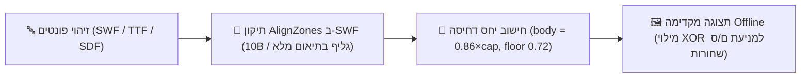

1. **חוק AlignZones:** תג 73 ב-SWF דורש בדיוק 10 בייט לכל גליף — חובה להרחיב בתיאום מלא.
2. **סדר עולה ב-Code Table:** שמירה על סדר Ascending ב-Scaleform ושימוש ב-Wide Offsets (0x08) בחריגה מ-0xFFFF.
3. **איפוס תווי בקרה:** מיפוי U+200F, U+200E לגליף ריק ברוחב 0 למניעת מלבני Tofu.
4. **תצוגה מקדימה ב-XOR:** רינדור ה-Offline חייב לבצע XOR למסלולים פנימיים (Counters) למניעת אותיות סגורות (ם, ס) שחורות.

---

## 5. קטגוריה 5: פאנל "עידן חדש" (New-Era Panel) ואורקל המגדר

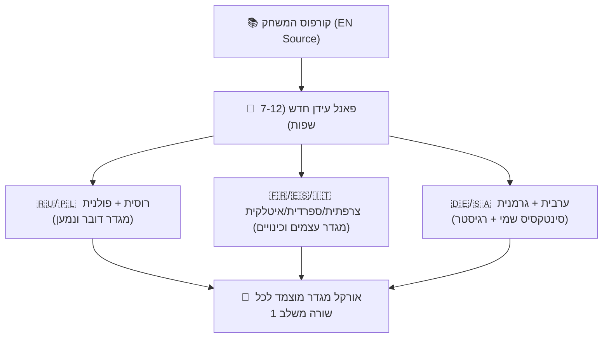

1. **אורקל מגדר רב-לשוני:** גזירת מגדר הדובר והנמען מרוסית ופולנית (-л/-ла, -łem/-łam) ומיפוי עצמים מצרפתית/ספרדית.
2. **חוק איסור איחוד לפי אנגלית (No Dedup):** 6.8%-44.7% מקבוצות האנגלית הזהות מתורגמות שונה בשפות המשחק המקצועיות — חובה לתרגם לפי מפתח שורה ייחודי (`string_key`).
3. **סיווג לפי נראות:** ממשק (UI) ➔ משימות ➔ כתוביות עלילה ➔ ספרים ותיאורים.

---

## 6. קטגוריה 6: צי התרגום הרב-ספקי (Fleet AI) וריפוי עצמי (Watchdogs)

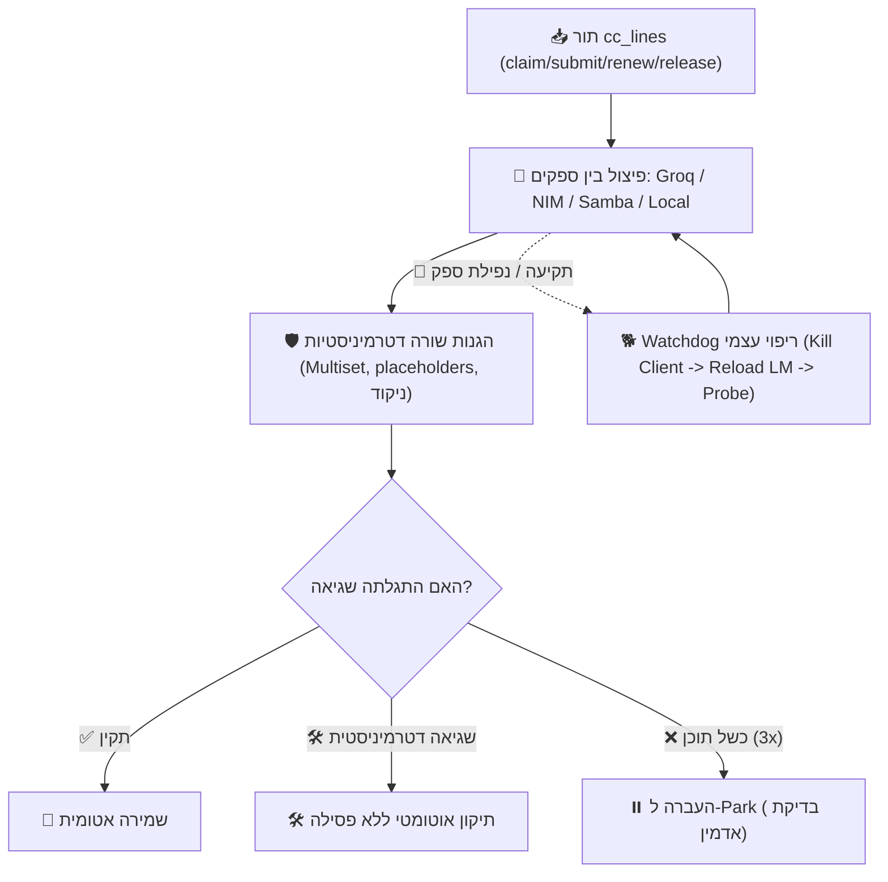

1. **חלוקת צי רב-ספקית (Multi-Provider Sharding):** חלוקת משימות דינמית ומנגנון In-flight cap (300 שורות) למניעת ניצול לרעה.
2. **תיקון דטרמיניסטי קודם לפסילה:** תיקון אוטומטי של תגים וסוגריים; רק כשל תוכן מתמשך מקבל Strike.
3. **סדר התאוששות קשיח ב-Watchdog:** הריגת הלקוח הנתקע ➔ שחרור מודל (`unload --all`) ➔ בדיקת קצה-לקצה ➔ הפעלה מחדש.
4. **הגנת UTF-8 stdout:** הגדרת `PYTHONIOENCODING=utf-8` למניעת קריסות שקטות של cp1255 ב-Windows.

---

## 7. קטגוריה 7: מערך הביקורת וה-LQA הרב-סוכני (Multi-Agent Review)

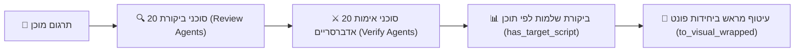

1. **אימות אדברסרי (20x20 Agents):** סוכני אימות נפרדים מבודקים את תפוקת סוכני התרגום והביקורת למניעת אישור סתמי.
2. **ביקורת שלמות לפי תוכן:** "100% מתורגם" נמדד לפי תוכן עברי בפועל ולא לפי נוכחות מפתחות.
3. **עיטוף מיועד מראש (Store-Visual Pre-Wrap):** מניעת היפוך סדר שורות בפסקאות ארוכות על ידי עיטוף לפי מקדמי `advanceX` של הפונט.

---

## 8. קטגוריה 8: מחשוב קהילתי (BYOK), Supabase והגנות אבטחה

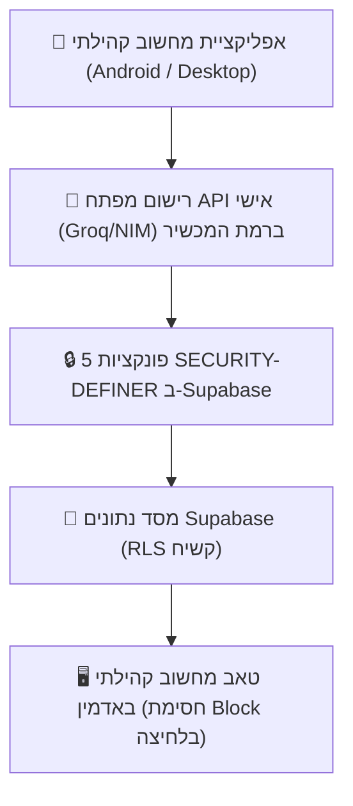

1. **אבטחה מלאה (BYOK):** המפתח וה-IP נשארים על מכשיר המשתמש בלבד ולא נשלחים לשרת לעולם.
2. **הרשאות Supabase קשיחות:** גישה דרך RPC בלבד; מתן הרשאות explicit ל-`service_role` למניעת שגיאות שקטות.
3. **לוח אדמין בלייב:** ניטור מכשירים מחוברים, קצב תפוקה ואפשרות Block מיידית למכשיר סורר.

---

## 9. קטגוריה 9: 8 תרחישים ויזואליים עם חצים (Visual Scenarios)

### 🛒 תרחיש 1: זיהוי מנוע חדש ➔ בדיקת Magic ➔ אימות Round-Trip
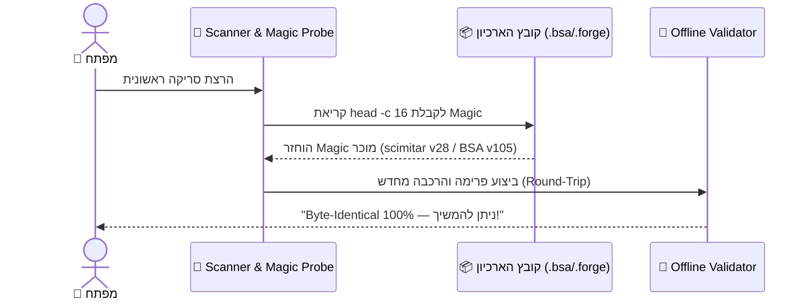

---

### 📸 תרחיש 2: בדיקת Bidi תפריט ➔ ניתוח A/B ➔ לכידה אוטונומית ב-dxcam
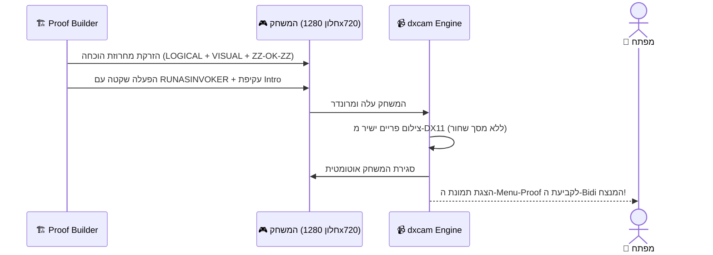

---

### 🔤 תרחיש 3: הזרקת פונטים ➔ כיול יחס דחיסה ➔ תצוגה מקדימה Offline
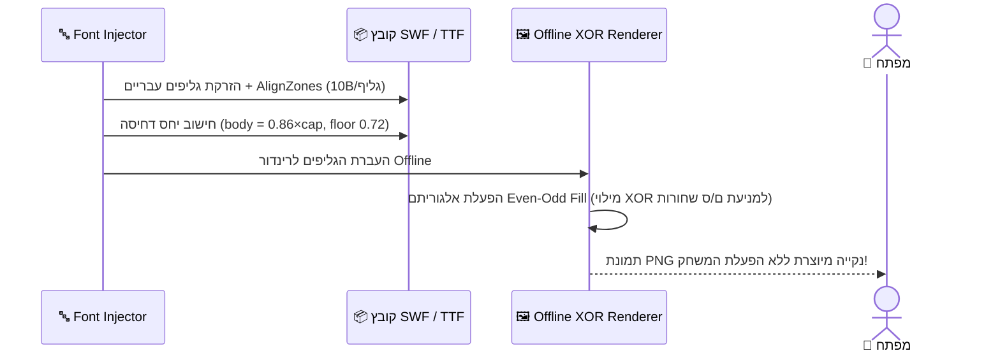

---

### 🧬 תרחיש 4: בניית פאנל 12 שפות ➔ גזירת מגדר רוסית/פולנית ➔ העלאה ל-Pool
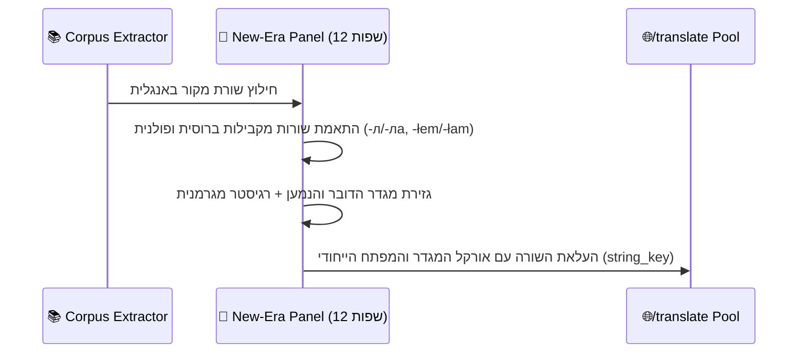

---

### 🚁 תרחיש 5: חלוקת משימות בצי ➔ הגנות דטרמיניסטיות ➔ התאוששות Watchdog
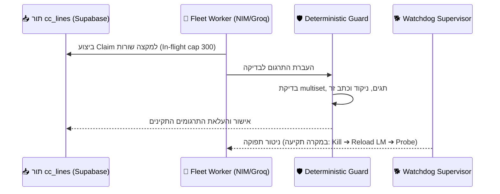

---

### 🧪 תרחיש 6: ביקורת LQA 20x20 ➔ אימות אדברסרי ➔ סריקת שלמות תוכן
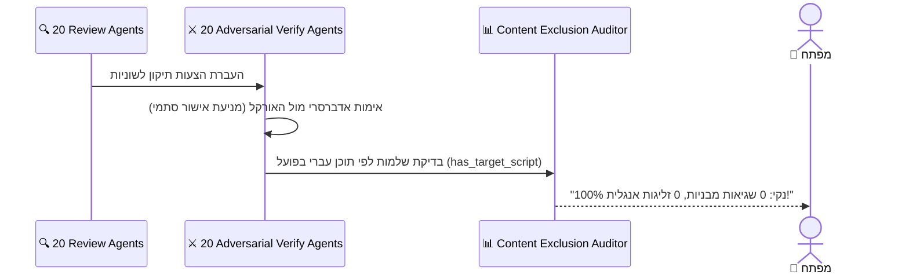

---

### 📱 תרחיש 7: תרומת מפתחות BYOK ➔ הרצה מוצפנת במכשיר ➔ ניטור אדמין
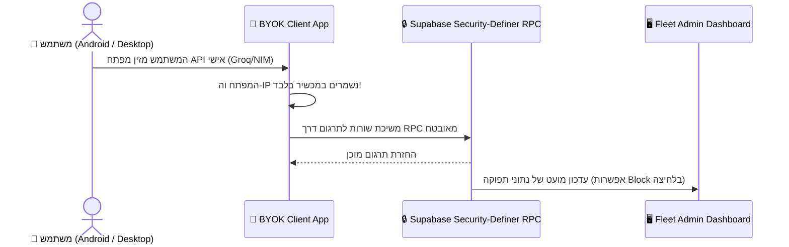

---

### 🏗️ תרחיש 8: בנייה מגיבוי נקי ➔ יישום נייטיב בלאנצ'ר ➔ סנכרון 4 המשטחים
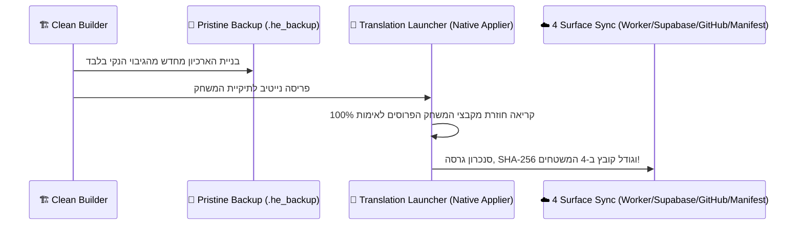

---

## 10. קטגוריה 10: סיכום מנהלים קצר וטבלת השוואה מרכזית

1. **אפס פשרות:** שילוב **100% מהמנועים הכירורגיים מ-CLAUDE.md** (פונטים, Bidi, מכולות, Oodle) עם **צי AI רב-ספקי, LQA רב-סוכני וסנכרון 4 המשטחים**.
2. **אמינות מוחלטת:** עבודה מבוססת גיבוי נקי (`.he_backup`), לכידה אוטונומית ב-`dxcam`, אימות מקבצי המשחק בפועל וריפוי עצמי מלא של הצי.
3. **פלטפורמה מאוחדת:** ניהול מלא מליד המחקר ועד למחשוב הקהילתי (BYOK) והפצה בלחיצה אחת בלאנצ'ר!

---

## 📊 טבלת השוואה מרכזית

| רכיב / שער ארכיטקטורה | גישה מסורתית / ידנית | גישת הצי הסטנדרטית | **ארכיטקטורת המאסטר המאוחדת** |
|---|---|---|---|
| **זיהוי מנועים ומכולות** | ניסוי וטעות ידני | סריקה כללית | ✅ **בדיקת Container Magic מוקדמת ושימוש חוזר מלא** |
| **טיפול ב-Bidi וזיהוי משטחים** | היפוך גורף של כל הטקסט | בדיקת Bidi אחת למוצר | ✅ **אבחון Per-Surface + זוג A/B מנצח + STORE-VISUAL** |
| **כיול פונטים וגליפים** | הזרקה בסיסית (ריבועי Tofu) | בדיקה בעין בתוך המשחק | ✅ **תיקון AlignZones, דחיסה מחושבת ו-XOR Preview** |
| **מקור המגדר והרגיסטר** | ניחוש מאנגלית | כללים ידניים בודדים | ✅ **פאנל "עידן חדש" (רוסית/פולנית/ערבית/גרמנית)** |
| **איחוד מחרוזות (Deduplication)** | איחוד לפי אנגלית (גורם לשגיאות) | איחוד לפי אנגלית | ✅ **איסור איחוד לפי אנגלית — מפתח ייחודי `string_key`** |
| **ניהול צי התרגום (Fleet AI)** | ספק יחיד (איטי/נתקע) | מספר ספקים בסיסי | ✅ **Multi-Provider Sharding + In-flight Cap + Watchdog** |
| **בדיקות איכות ו-LQA** | בדיקה ידנית אקראית | סוכן ביקורת יחיד | ✅ **LQA רב-סוכני 20x20 + בדיקת שלמות לפי תוכן** |
| **מחשוב קהילתי (BYOK)** | אין / שליחת מפתחות לשרת | אין | ✅ **הרצה מוצפנת במכשיר + 5 RPCs ב-Supabase** |
| **בנייה ופריסה נייטיב** | דריסת קבצים מוטמעים | פריסה רגילה | ✅ **בנייה מגיבוי נקי (`.he_backup`) + סנכרון 4 המשטחים** |

> [!IMPORTANT]
> **השורה התחתונה:** ארכיטקטורת המאסטר מעניקה לך את **מערכת התרגום, הצי והאיכות המתקדמת והאמינה ביותר**, המבטיחה עברית מושלמת, תהליך אוטונומי קשיח וסנכרון מלא מקצה לקצה!
