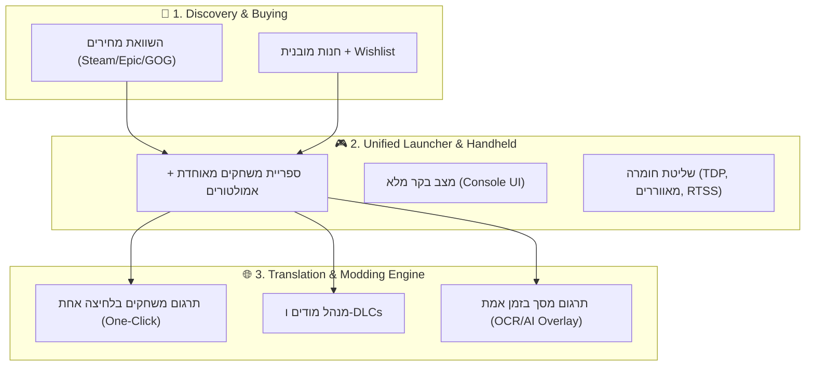
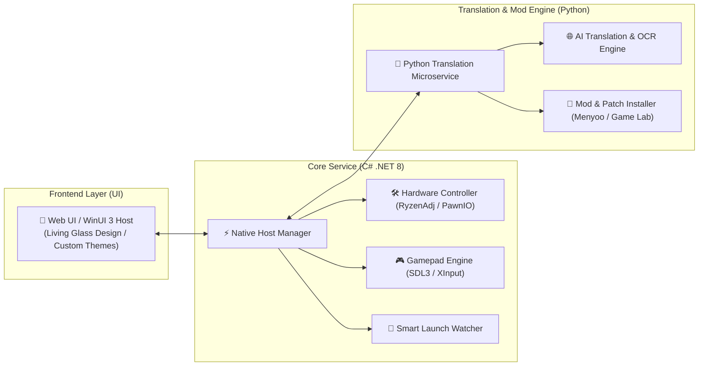
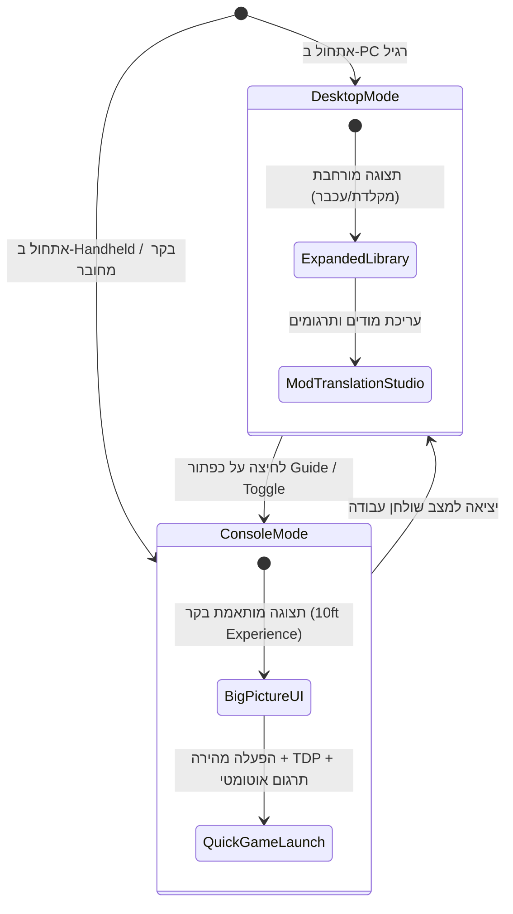
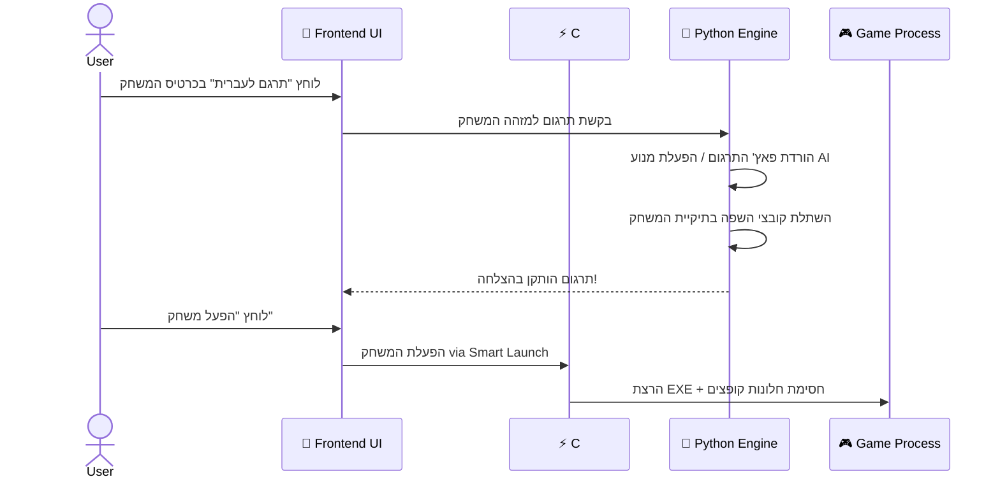
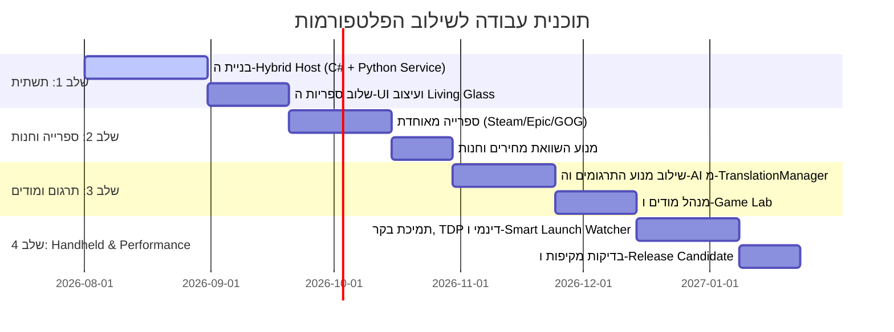

# 🚀 ארכיטקטורה ותוכנית אב: הפלטפורמה המשולבת (Ultimate Gaming & Translation Hub)

> **תאריך:** 30 ביולי 2026  
> **חזון:** איחוד מוחלט בין היתרונות של **Winhanced** (ספרייה מאוחדת, חנות מחירים, מצב בקר, בקרת חומרה ו-Sleep/Wake) לבין היתרונות של **TranslationManager** (תרגום משחקים אוטומטי, התקנת מודים, מנוע AI ועיצוב מותאם אישית) לכדי **פלטפורמה אחת עוצמתית**.

---

## 1. חזון העל של הפלטפורמה המשולבת

הפלטפורמה החדשה לא רק מציגה משחקים או מנהלת תרגומים — היא תהיה **אקו-סיסטם גיימינג שלם**:

---

## 2. הארכיטקטורה הטכנית ההיברידית (The Hybrid Core)

כדי לקבל גם את הביצועים של C# וגם את הגמישות של Python/Web, המערכת תתבסס על **ארכיטקטורת מיקרו-שירותים מקומית (Local Microservices)**:

### היכן כל לוגיקה תפעל?
1. **C# Core Host:**
   * ניהול תהליכים, Smart Launch Watcher (זיהוי UAC/AntiCheat).
   * ניטור חומרה בזמן אמת, שליטה ב-TDP ובמאווררים.
   * קריאת תשומת בקר (Gamepad Input) ברמה נמוכה (SDL3/XInput).
2. **Python Engine Service:**
   * מנועי התרגום (AI, Google Translate, DeepL, parsing של קובצי משחק).
   * התקנת מודים, חילוץ ארכיונים, ניהול DLCs ופלאגינים.
3. **Frontend UI Layer (Web/React או WinUI 3):**
   * תצוגת זכוכית שקופה (Living Glass), ערכות נושא מותאמות אישית, תמיכה במסך מגע ובקר.

---

## 3. מבנה הממשק והחוויה הויזואלית (UI/UX Design)

הממשק יכלול **שני מצבי תצוגה בלחיצת כפתור אחת**:

### מסכי הליבה בממשק:

1. **Dashboard & Unified Library (ספרייה מאוחדת):**
   * כרטיס לכל משחק המציג:
     * **תמונת HD / Cover Art** מ-SteamGridDB.
     * **תג תרגום:** "בעברית" / "זמין לתרגום בלחיצה אחת" / "מודים מותקנים".
     * **תג ביצועים:** דירוג FPS צפוי במכשיר שלך.

2. **כרטיס משחק מורחב (Game Hub Detail):**
   * **כפתור "הפעל משחק"** (בצבע בולט).
   * **כפתור "תרגם משחק"** — בלחיצה אחת התוכנה מורידה ומתקינה את התרגום המתאים.
   * **כפתור "ניהול מודים"** — התקנת מודים מ-Game Lab.
   * **פאנל השוואת מחירים** — אם המשחק לא מותקן, מוצג המחיר הזול ביותר (Steam / Epic / GOG).

3. **In-Game Overlay (שכבת-על תוך כדי משחק):**
   * נפתחת בלחיצה על כפתור ה-Xbox/Guide בבקר:
     * **TDP & Fan Control:** שינוי צריכת חשמל בלייב.
     * **תרגום מסך בזמן אמת (Live OCR Translation):** תרגום דיאלוגים מוקפצים על המסך בלייב.
     * **FPS Overlay (RTSS):** תצוגת נתוני חומרה.

---

## 4. תרחישי שימוש מקצה לקצה (End-to-End User Scenarios)

### 🛒 תרחיש 1: גילוי, השוואת מחירים וקנייה

1. המשתמש נכנס לכרטיסייה **"Store"** בממשק.
2. המערכת מציגה משחק מוביל עם השוואת מחירים בזמן אמת:
   * Steam: $29.99 | Epic Games: $19.99 | GOG: $24.99
3. המשתמש לוחץ "קנה ב-Epic Games" והמערכת פותחת את תהליך הרכישה המאובטח.
4. לאחר ההורדה, המשחק מופיע **אוטומטית** בספרייה המאוחדת.

---

### 🌐 תרחיש 2: תרגום בלחיצה אחת (One-Click Game Translation)

---

### 🎮 תרחיש 3: משחק במכשיר Handheld בדרכים עם תרגום מסך בלייב

1. המשתמש מפעיל את מכשיר ה-ROG Ally / Legion Go.
2. התוכנה עולה ב-**Console Mode** במסך מלא עם סאונד פתיחה ואנימציה.
3. המשתמש בוחר משחק בעזרת הסטיק של הבקר ולוחץ A.
4. **Smart Launch Watcher** מטפל בחלונות UAC ו-AntiCheat ברקע.
5. תוך כדי משחק, המשתמש נתקל בטקסט באנגלית:
   * לוחץ על צירוף מקשים בבקר (למשל `LB + RB + D-Pad Down`).
   * שכבת-על (Overlay) מבצעת **OCR מתקדם ומציגה תרגום לעברית מעל המסך**.
   * המשתמש משנה TDP ל-15W כדי לחסוך בסוללה וחוזר לשחק.

---

## 5. מפת דרכים ליישום (Implementation Roadmap)

---

## 6. סיכום ומטריצת יתרונות

| תחום | Winhanced לבד | TranslationManager לבד | **הפלטפורמה המשולבת** |
|---|---|---|---|
| **ממשק מוכוון בקר (Console UI)** | ✅ מצוין | ❌ אין | ✅ **מלא** |
| **תרגום משחקים אוטומטי** | ❌ אין | ✅ מצוין | ✅ **מלא (כולל OCR בלייב)** |
| **התקנת מודים ו-DLCs** | ❌ אין | ✅ מצוין | ✅ **מלא** |
| **השוואת מחירים וחנות** | ✅ כן | ❌ אין | ✅ **מלא** |
| **שליטה בחומרה (TDP/מאווררים)** | ✅ מצוין | ❌ אין | ✅ **מלא** |
| **עיצוב מותאם אישית (Custom Themes)** | ⚠️ מוגבל | ✅ מצוין | ✅ **מלא** |

> [!IMPORTANT]
> **השורה התחתונה:** השילוב בין שתי התוכנות יוצר את **משגר המשחקים (Launcher) המתקדם ביותר למשתמש הדובר עברית** — פלטפורמה שמציעה גם חנות וספרייה מאוחדת, גם שליטה מלאה בחומרה ובבקר, וגם יכולות תרגום והתקנת מודים בלחיצת כפתור אחת.
