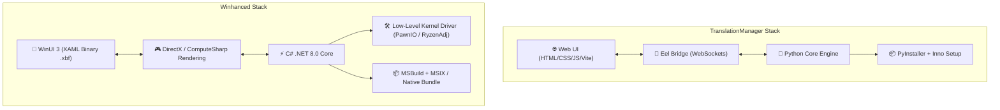
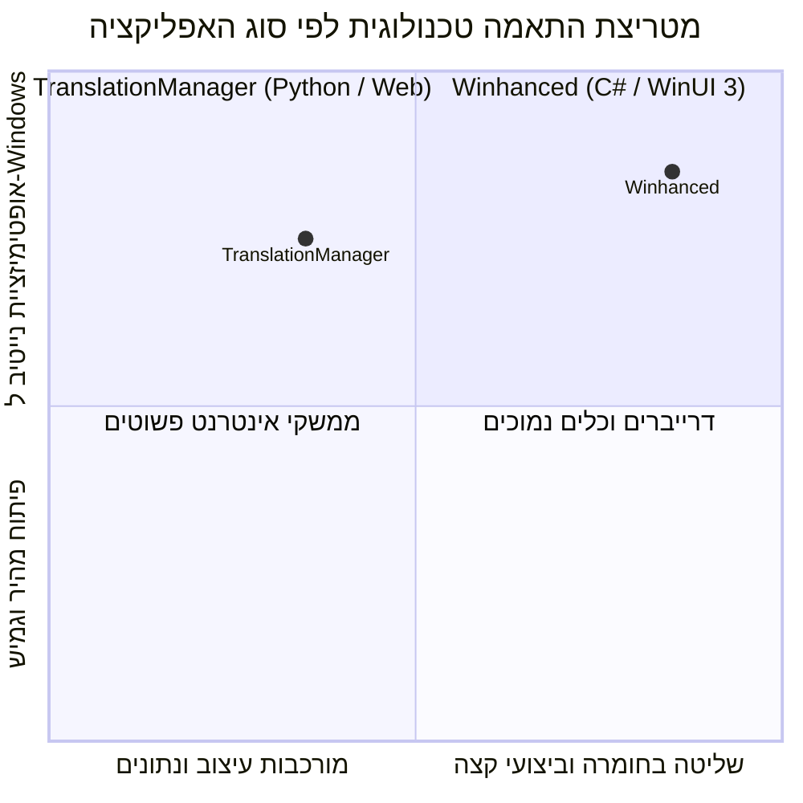

# 📊 דוח השוואה ארכיטקטונית ותרחישי שימוש
## TranslationManager מול Winhanced

> **תאריך:** 30 ביולי 2026  
> **מטרה:** ניתוח הבדלי הפיתוח והבסיס הטכנולוגי בין התוכנה שלך (`TranslationManager`) לבין תוכנת `Winhanced`, כולל בחינת תרחישי שימוש (Scenarios) מעשיים.

---

## 1. סקירת בסיס הפיתוח והארכיטקטורה



---

## 2. השוואה טכנית מפורטת

| רכיב ארכיטקטוני | TranslationManager (התוכנה שלך) | Winhanced |
|---|---|---|
| **שפת ליבה (Backend)** | **Python 3** | **C# (.NET 8.0)** |
| **מנוע הממשק (Frontend)** | **Web Technologies** (HTML, CSS, JavaScript, React/Vite) | **WinUI 3** (Windows App SDK 2.0.1) |
| **מנוע רינדור (Rendering Engine)** | מנוע דפדפן **Chromium / Edge WebView2** (באמצעות Eel) | מנוע נייטיב של Windows המואץ חומרה דרך **DirectX / Direct2D** |
| **ייצוג ה-UI בזיכרון** | DOM (Document Object Model) של HTML | עץ רכיבי XAML מקומפלים מראש בפורמט בינארי (`.xbf`) |
| **ארכיטקטורת תהליכים** | תהליך פייתון ראשי + תהליכי דפדפן (Chromium Helper Processes) | תהליך C# מנוהל (Managed Process) + שירותי רקע נפרדים |
| **אריזה והפצה** | **PyInstaller** (קיבוץ סביבת Python וה-Web) + **Inno Setup** | **MSBuild** (קימפול ל-DLL/EXE נייטיב) + **MSIX Bundle** |
| **אינטגרציית חומרה** | ספריות עיליות (`requests`, `pystray`, `keyring`) | גישה ישירה ל-Kernel via `PawnIO`, `libryzenadj.dll` (C/C++ Interop) |

---

## 3. תרחישי שימוש (Scenarios) והשוואת ביצועים

### 🎭 תרחיש 1: עיצוב ממשק משתמש וגמישות ויזואלית (UI Design & Styling)

* **התרחיש:** שינוי עיצוב מהיר, הוספת אפקטים ויזואליים מורכבים (Glassmorphism, אנימציות, טיפוגרפיה מותאמת).
* **TranslationManager (Python + Web):**
  * **יתרון מכריע:** שימוש ב-CSS3 מעניק גמישות בלתי מוגבלת. אפשר להשתמש ב-`backdrop-filter`, `flexbox`, `grid`, ואנימציות CSS/GSAP בקלות רבה.
  * **תוצאה:** מהירות עדכון עיצוב גבוהה מאוד, אין צורך לקמפל מחדש את האפליקציה בשינויי עיצוב קלים.
* **Winhanced (C# + WinUI 3):**
  * **מורכבות:** העיצוב מבוסס על סגנונות XAML ומשאבים מקומפלים (`.xbf`). כל שינוי ויזואלי דורש הגדרת סגנונות ב-XAML וקימפול הפרויקט.
  * **תוצאה:** עיצוב אחיד מאוד לשפת העיצוב של Windows 11, אך דורש יותר קוד ומורכבות לעיצובים מותאמים אישית.

---

### 🎮 תרחיש 2: עבודה ברקע תוך כדי משחק כבד (In-game Performance & Footprint)

* **התרחיש:** התוכנה רצה ברקע או מציגה שכבת-על (Overlay) בזמן שהמשתמש משחק במשחק AAA כבד.
* **Winhanced (C# + WinUI 3):**
  * **יתרון מכריע:** מכיוון שהיא מבוססת C# ונייטיב DirectX, צריכת זיכרון ה-RAM שלה וה-CPU Overhead נמוכים. היא אינה מפריעה לביצועי המשחק.
* **TranslationManager (Python + Web):**
  * **אתגר:** מנוע Chromium המריץ את ה-Web UI תופס נפח זיכרון (RAM) משמעותי יותר (לרוב 150MB-400MB) בשל תהליכי הדפדפן ברקע.
  * **השפעה:** מתאים מאוד לאפליקציות ניהול ותרגום שרצות לפני או לצד המשחק, אך דורש אופטימיזציה אם רוצים להריץ Overlay רציף תוך כדי משחק כבד.

---

### 🛠️ תרחיש 3: שליטה בחומרה ברמה נמוכה (Low-Level Hardware Control)

* **התרחיש:** שינוי תדרי מעבד, צריכת חשמל (TDP), קריאת חיישנים ברמת Ring0, ושליטה במאווררים.
* **Winhanced (C# + WinUI 3):**
  * **נבנתה במיוחד לכך:** משתמשת ב-C# P/Invoke כדי לתקשר ישירות עם דרייבר Kernel (`PawnIO.sys`) וספריות C++ כמו `libryzenadj.dll`.
* **TranslationManager (Python + Web):**
  * **אפשרי אך פחות טבעי:** Python יכולה לקרוא לספריות C (דרך `ctypes` או `cffi`), אך הארכיטקטורה מיועדת יותר לניהול נתונים, עיבוד טקסט, תרגומים ותקשורת רשת.

---

### ⚡ תרחיש 4: מהירות פיתוח, עיבוד נתונים ותרגום (Development Velocity & Logic)

* **התרחיש:** ניהול קבצי תרגום, פריסת קבצים, תקשורת מול שרתי תרגום, וניהול נתוני משחקים.
* **TranslationManager (Python + Web):**
  * **יתרון מכריע:** Python היא השפה המובילה בעולם לניהול נתונים, עיבוד טקסטים, סקריפטים ואינטגרציות AI/API. פיתוח לוגיקת תרגום וניהול משחקים ב-Python מהיר פי כמה מאשר ב-C#.
* **Winhanced (C# + WinUI 3):**
  * **סרבול מסוים:** ניתוח טקסטים וניהול קבצים ב-C# דורשים יותר boilerplate code בהשוואה ל-Python.

---

## 4. מטריצת החלטה: "מה עדיף מתי?"



| צורך / תרחיש | התלם המומלץ | הסיבה |
|---|---|---|
| **תוכנת ניהול, תרגום וקטלוג משחקים** | **Python + Web (TranslationManager)** | מהירות פיתוח, עשרות ספריות עיבוד טקסט, ממשק גמיש ב-CSS |
| **מעטפת משחקים (Shell Launcher) ל-Handheld** | **C# + WinUI 3 (Winhanced)** | צריכת משאבים אפסית ברקע, רינדור DirectX מהיר בבקר |
| **עיצוב זכוכית (Glassmorphism) מודרני** | **שני המסלולים** | ב-Web דרך CSS (`backdrop-filter`), ב-WinUI 3 דרך `AcrylicBrush` |

---

## 5. מסקנות והמלצות מעשיות ל-TranslationManager

1. **אוסף הטכנולוגיות שלך (Python + Web) מדויק למטרת התוכנה שלך:**  
   עבור `TranslationManager` (ניהול ותרגום משחקים), הארכיטקטורה של Python ב-Backend ו-Web ב-Frontend היא הבחירה הנכונה ביותר. היא מאפשרת לך לעבד נתונים ולשנות את ה-UI במהירות שאינה מתאפשרת ב-C#.

2. **איך להשיג את העיצוב של Winhanced בתוך ה-Stack שלך:**  
   אינך צריך לעבור ל-C# או לקמפל XAML. תוכל להגיע לאותו מראה "Living Glass" ב-CSS של ה-Frontend שלך:
   ```css
   .glass-card {
       background: rgba(26, 26, 46, 0.75);
       backdrop-filter: blur(20px) saturate(180%);
       border: 1px solid rgba(255, 255, 255, 0.12);
       border-radius: 16px;
       box-shadow: 0 8px 32px 0 rgba(0, 0, 0, 0.37);
   }
   ```
