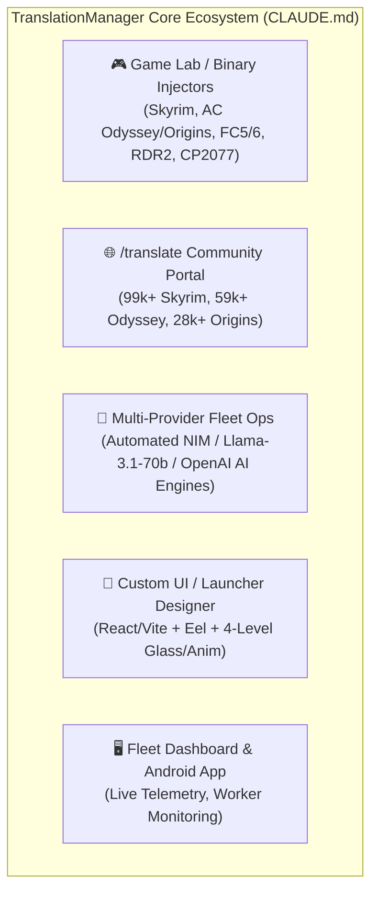
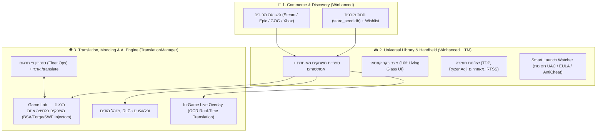
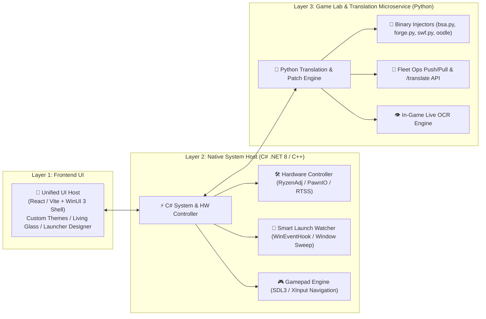
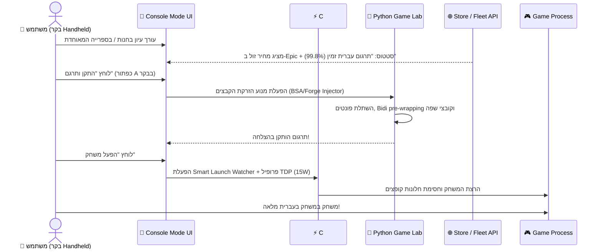

# 📘 דוח ארכיטקטורה ותוכנית אב: פלטפורמת העל המאוחדת
## TranslationManager × Winhanced (Master Blueprint)

> **תאריך:** 30 ביולי 2026  
> **מבוסס על:** ניתוח מעמיק של קובץ הפרויקט `CLAUDE.md` והקוד של **TranslationManager**, יחד עם יכולות **Winhanced**.

---

## 1. ניתוח מעמיק של TranslationManager (לפי CLAUDE.md)

מתוך ניתוח מעמיק של קובץ `CLAUDE.md`, **TranslationManager** היא אינה תוכנת תרגום רגילה, אלא **מערכת הנדסה לאחור (Reverse Engineering) והזרקת בינאריים מתקדמת ביותר למשחקי AAA**:

### יכולות הליבה הקיימות ב-TranslationManager:
1. **מנועי הזרקה ייחודיים לפי מנועי משחק (Engine-Specific Binary Patchers):**
   * **Bethesda Creation Engine (Skyrim SE):** הזרקת גופנים (DefineFont3 SWF), תרגום קובצי `.STRINGS`/`.ILSTRINGS`/`.DLSTRINGS`, והזרקת `translate_english.txt` תוך טיפול ב-VISUAL Bidi וסנכרון תפריט ה-Launcher (`SkyrimSELauncher.exe`).
   * **Ubisoft AnvilNext 2.0 (AC Odyssey / Origins):** פענוח קובצי `.forge`, חילוץ וקידוד מחדש ב-Oodle (Mermaid/Kraken), הזרקת גופני Heebo לתוך DINPro/Friz Quadrata, pre-wrapping אוטומטי של שורות לפי רוחב פיקסלים (`text_em`), וזיהוי חבילות שפה (`LocalizationPackage_Arabic` / `ar-AR`).
   * **Ubisoft Dunia 2 (Far Cry 5 / 6):** פענוח קובצי `.fat`/`.dat`, קידוד Scheme-2/Zlib, והזרקת גופני `.ffd`+`.xbt`.
   * **Rockstar RAGE (RDR2/GTA) & CDPR REDengine (CP2077):** מנועי תרגום מורכבים למשחקי ענק.
2. **תשתית ה-Fleet Ops & Community Portal (`/translate`):**
   * צי תרגום אוטומטי מבוסס AI Multi-Provider (NIM, Llama-3.1-70b, OpenAI) שמריץ אלפי שורות במקביל.
   * אתר קהילתי (`/translate`) לניהול תיקונים, Gender Oracle (זיהוי מגדר דובר/פונה מרוסית/פולנית), ופתרון קונפליקטים.
3. **אוטומציה ובדיקות אוטונומיות (Autonomous In-Game Proofs):**
   * הרצת משחק אוטומטית ברקע (`autocheck.py`), לכידת מסך ב-DirectX (`dxcam`), זיהוי טקסט ואימות תקינות הפונטים וה-Bidi בלייב, וסגירה שקטה ללא חלונות קופצים.

---

## 2. חזון פלטפורמת העל (Master Unified Platform)

הפלטפורמה המאוחדת תיקח את **כל יכולות ה-Reverse Engineering, ה-Fleet והתרגום מ-TranslationManager**, ותשלב אותן בתוך **מנוע הביצועים, חנות המחירים, מצב הבקר (Handheld) וה-Smart Launch מ-Winhanced**.

---

## 3. ארכיטקטורת המערכת ההיברידית (Hybrid Core Architecture)

כדי לאבד שום יכולת קיימת ולשמור על ביצועי שיא, המערכת תתבסס על **ארכיטקטורה משולבת של C# Host + Python Service**:

---

## 4. הממשק והחוויה הויזואלית (UI/UX Design)

הממשק יציע **שני מצבי עבודה מותאמים מראש**:

### 💻 4.1 מצב דסקטופ (Desktop Mode)
הממשק הקיים והמוכר של **TranslationManager** (עם ה-Launcher Designer, Icon Manager, וניהול המשחקים), בתוספת:
* **טאב Store (חנות):** השוואת מחירים בזמן אמת בין Steam, Epic Games, GOG ו-Xbox.
* **פאנל Fleet Ops:** מעקב בלייב אחר התקדמות צי התרגום (כמו ב-`fleet_dashboard`).
* **Game Lab מורחב:** כלי דיאגנוסטיקה, בדיקת גופנים (Preview offline), וניהול מודים.

### 🎮 4.2 מצב קונסולה/בקר (Handheld Console Mode - 10ft UI)
מצב מסך מלא מותאם בקר (ROG Ally, Legion Go, Xbox Controller):
* **Living Glass UI:** רקעי זכוכית שקופים, אפקטי זוהר (Bloom), ואנימציות Lottie.
* **ניווט מלא בסטיק ובכפתורי Bumpers (LB/RB).**
* **כרטיס משחק חכם:** מציג תמונת Cover Art מ-SteamGridDB, מחיר עדכני, **וסטטוס תרגום בלחיצה אחת**.

---

## 5. מפרט פיצ'רים מפורט (Feature Specification)

### 🛒 5.1 מנוע החנות והשוואת מחירים (Store & Price Aggregator)
* **קטלוג מקומי מהיר:** מבוסס על `store_seed.db` (167 MB, מתוך Winhanced) המאפשר עיון במשחקים גם ללא חיבור לרשת.
* **השוואת מחירים בזמן אמת:** שליפת מחירים מ-Steam Store API, Epic Games, GOG ו-Game Pass.
* **כפתור "קנה והתקן":** מעביר ישירות לחנות הזולה ביותר, ולאחר ההתקנה המשחק מזוהה אוטומטית בספרייה.

### 🎮 5.2 ספרייה מאוחדת ו-Smart Launch Watcher
* **זיהוי אוטומטי:** סריקת Steam, Epic, GOG, Xbox, אמולטורים (22+ פלטפורמות דרך `EmulatorRules.json`) ואפליקציות.
* **Smart Launch Watcher (חסימת חוסמים):** מעקב אחר חלונות UAC, התקנות DirectX/VC++, אישורי EULA, ומסכי התחברות של Launchers כדי לספק הפעלה חלקה.

### 🌐 5.3 מנוע התרגומים וההזרקות המתוחכם (Game Lab)
* **One-Click Hebrew Patching:** בלחיצת כפתור אחת (גם מהבקר), המערכת מפעילה את מנוע הפייתון הקיים ב-TranslationManager:
  * **Skyrim SE:** הזרקת `fonts_en.swf` (Heebo/Frank Ruhl), עדכון `translate_english.txt` וקובצי `.STRINGS`, וטיפול ב-VISUAL Bidi + תרגום ה-Launcher (`SkyrimSELauncher.exe`).
  * **AC Odyssey / Origins:** פענוח קובצי `.forge`, קידוד Oodle, pre-wrapping אוטומטי (`aor_rtl.to_visual_wrapped`), והזרקת גופנים.
  * **Far Cry 5 / 6:** הזרקת גופני `.ffd`/`.xbt` וקידוד Scheme-2.
* **אימות אוטונומי (Autonomous Proof):** הרצת בדיקה שקטה ברקע (`dxcam` capture) לאימות שהפונט וה-Bidi נראים מושלם במשחק לפני שהמשתמש משחק.

### 🤖 5.4 אינטגרציית Fleet Ops וסנכרון קהילה (`/translate`)
* **חיבור מלא לאתר הקהילה (`/translate`):** כרטיסי המשחקים מציגים את התקדמות התרגום הקהילתי בזמן אמת.
* **Gender Oracle:** שימוש בנתוני המגדר (מרוסית/פולנית) בעת הורדת התרגומים החדשים.
* **סנכרון צי (Fleet Push/Pull):** התוכנה יכולה לתרום כוח עיבוד מקומי (Community Compute) או למשוך את העדכונים האחרונים מצי ה-AI.

### ⚡ 5.5 שליטת חומרה (Hardware & TDP Control)
* **RyzenAdj Integration:** שליטה בזמן אמת ב-PPT Fast/Slow Limit, STAPM, וטמפרטורות מעבד.
* **עקומות מאווררים ופרופילים חכמים (Smart Profiles):** פרופיל מותאם לכל משחק שמחיל אוטומטית את צריכת החשמל האידיאלית.

### 👁️ 5.6 In-Game Live Overlay (שכבת-על תוך כדי משחק)
לחיצה על מקש קיצור או כפתור Guide בבקר פותחת שכבת-על:
1. **נתוני חומרה (RTSS):** תצוגת FPS, טמפרטורה, וניצול סוללה.
2. **TDP Quick Switch:** שינוי מצב חשמל (סוללה / ביצועים) תוך כדי משחק.
3. **Live OCR Translator:** זיהוי טקסט על המסך בזמן אמת ותרגומו לעברית בשכבה שקופה מעל המשחק.

---

## 6. תרחישי שימוש מקצה לקצה (End-to-End Scenarios)

---

## 7. מטריצת יתרונות: המצב הקיים מול הפלטפורמה המשולבת

| רכיב / פיצ'ר | TranslationManager הקיים | Winhanced | **הפלטפורמה המאוחדת** |
|---|---|---|---|
| **מנועי הזרקה למשחקי AAA (BSA, Forge, FFD, SWF)** | ✅ **בעלת המנועים המתקדמים ביותר** | ❌ אין בכלל | ✅ **משולב ב-Game Lab** |
| **צי תרגום AI (Fleet Ops) ואתר `/translate`** | ✅ **מערכת לייב עובדת** | ❌ אין | ✅ **סנכרון מלא בלייב** |
| **מצב בקר מותאם (Handheld 10ft UI)** | ❌ אין (מיועד לעכבר/מקלדת) | ✅ מצוין | ✅ **תמיכה מלאה בבקר** |
| **שליטה בחומרה (TDP / RyzenAdj / מאווררים)** | ❌ אין | ✅ מצוין | ✅ **שליטה מלאה בחומרה** |
| **חנות והשוואת מחירים (Cross-Store)** | ❌ אין | ✅ מותקן (167MB DB) | ✅ **חנות השוואת מחירים** |
| **Smart Launch Watcher (חסימת חוסמים)** | ⚠️ חלקי (בדיקות שקטות) | ✅ מתקדם | ✅ **מלא** |
| **עיצוב מותאם (Launcher Designer / Icons)** | ✅ **מערכת מקיפה קיימת** | ⚠️ מוגבל | ✅ **גמישות עיצובית מלאה** |

---

## 8. סיכום והמלצה מעשית

השילוב בין **TranslationManager** ל-**Winhanced** יוצר מוצר שאין לו מתחרים בשוק הגיימינג:
* מחד, **העוצמה הטכנולוגית של TranslationManager** בפיצוח מנועי משחק, הזרקת גופנים, ניהול Bidi וצי ה-AI.
* מאידך, **חוויית המשתמש והביצועים של Winhanced** בספרייה מאוחדת, חנות מחירים, מצב בקר ובקרת חומרה.

### הצעד הראשון המומלץ:
להמשיך להשתמש ב-Python וב-Web Frontend הקיים של `TranslationManager` כבסיס, ולהוסיף לו **שירות C# קטן ברקע (C# Helper Service)** שיטפל ב-TDP (RyzenAdj), בקרת בקר (Gamepad Navigation) ו-Smart Launch Watcher. באופן הזה תקבל את **כל היתרונות של Winhanced** מבלי לשנות את קוד התרגומים וההזרקות העוצמתי שבנית!
