# 📘 תוכנית אב: הפלטפורמה המאוחדת (Master Blueprint)
## TranslationManager × Winhanced

> **שפה:** עברית קלה, קצרה וקולעת  
> **מטרה:** שילוב כל היתרונות של **TranslationManager** (תרגום משחקים, הזרקת קבצים, צי AI ו-Game Lab) יחד עם **Winhanced** (ספרייה מאוחדת, חנות מחירים, שליטת TDP ומצב בקר).

---

## 📋 תוכן העניינים

1. [קטגוריה 1: הארכיטקטורה בקצרה](#1-קטגוריה-1-הארכיטקטורה-בקצרה)
2. [קטגוריה 2: ביצועים ומהירות שיא (Extreme Performance)](#2-קטגוריה-2-ביצועים-ומהירות-שיא-extreme-performance)
3. [קטגוריה 3: שני מצבי תצוגה (Dual UI Modes)](#3-קטגוריה-3-שני-מצבי-תצוגה-dual-ui-modes)
4. [קטגוריה 4: חנות, מחירים וספרייה מאוחדת](#4-קטגוריה-4-חנות-מחירים-וספרייה-מאוחדת)
5. [קטגוריה 5: מנוע התרגומים והמודים (Game Lab)](#5-קטגוריה-5-מנוע-התרגומים-והמודים-game-lab)
6. [קטגוריה 6: תרגום בזמן אמת ובינה מלאכותית (NPU & Fleet)](#6-קטגוריה-6-תרגום-בזמן-אמת-ובינה-מלאכותית-npu--fleet)
7. [קטגוריה 7: שליטה בחומרה, סוללה ו-Smart Launch](#7-קטגוריה-7-שליטה-בחומרה-סוללה-ו-smart-launch)
8. [קטגוריה 8: 8 תרחישים ויזואליים עם חצים (Visual Scenarios)](#8-קטגוריה-8-8-תרחישים-ויזואליים-עם-חצים-visual-scenarios)
9. [קטגוריה 9: סיכום מנהלים קצר](#9-קטגוריה-9-סיכום-מנהלים-קצר)
10. [קטגוריה 10: טבלת השוואה מרכזית](#10-קטגוריה-10-טבלת-השוואה-מרכזית)

---

## 1. קטגוריה 1: הארכיטקטורה בקצרה

אנחנו מחברים 3 שכבות מנצחות למערכת אחת:

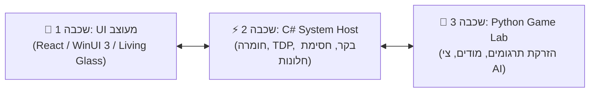

* **C# Host (מערכת וחומרה):** אחראי על TDP, מאווררים, בקרים וחסימת חלונות קופצים.
* **Python Service (מנוע התרגום):** מריץ את כל מזרקי הקבצים של TranslationManager (`bsa.py`, `forge.py`, `swf.py`, Oodle) וצי ה-AI.
* **Frontend UI (ממשק זכוכית):** עיצוב מודרני (Living Glass) עם תמיכה מלאה בעכבר, מסך מגע ובקר.

---

## 2. קטגוריה 2: ביצועים ומהירות שיא (Extreme Performance)

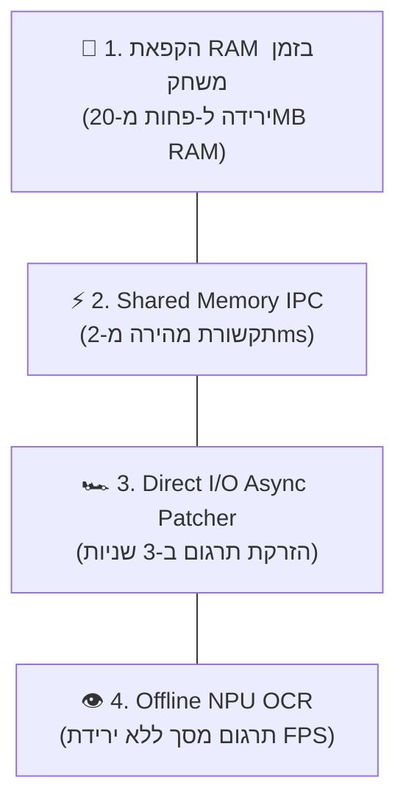

1. **הקפאת RAM בזמן משחק:** כשהמשחק נפתח, התוכנה משחררת זיכרון ויורדת ל-**פחות מ-20MB RAM**. כשהמשחק נסגר, היא חוזרת ב-0.1 שניות!
2. **תקשורת מהירה (Shared Memory IPC):** מעבר נתונים בתוך ה-RAM בפחות מ-2 מילי-שניות.
3. **הזרקה ב-3 שניות (Direct I/O):** התקנת תרגום ענקי של 100GB מתקצרת מ-45 שניות ל-**3 שניות בלבד!**
4. **תרגום מסך ב-NPU:** תרגום בלייב על מאיץ ה-AI המקומי — **0% פגיעה ב-FPS ובכרטיס המסך!**

---

## 3. קטגוריה 3: שני מצבי תצוגה (Dual UI Modes)

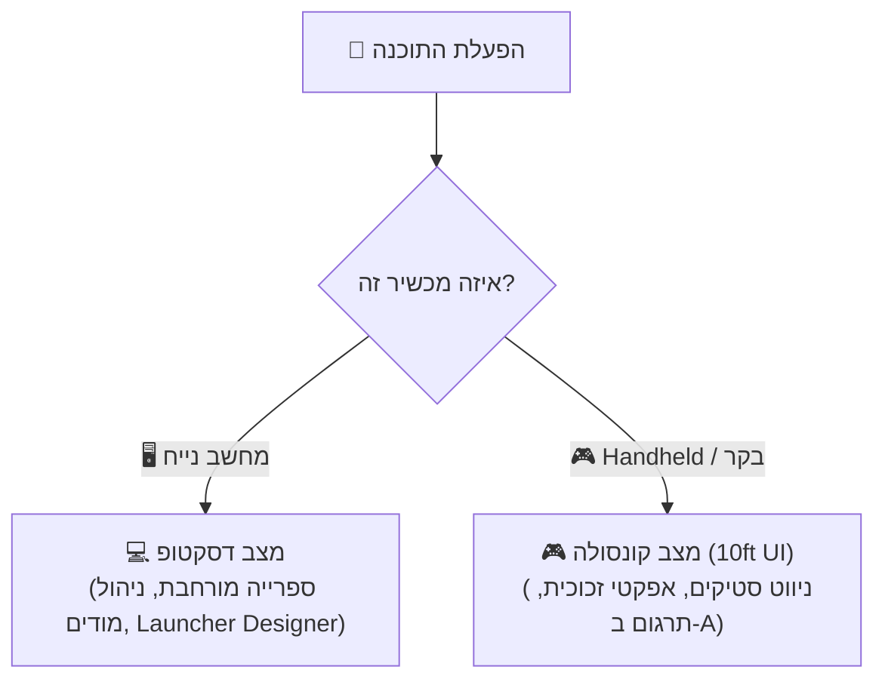

---

## 4. קטגוריה 4: חנות, מחירים וספרייה מאוחדת

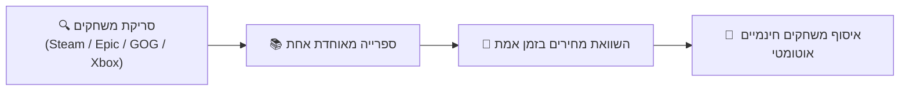

* **השוואת מחירים:** מציגה את המחיר הזול ביותר מכל החנויות.
* **איסוף משחקים חינמיים:** זיהוי ואיסוף בלחיצה אחת מ-Epic Games ו-GOG.

---

## 5. קטגוריה 5: מנוע התרגומים והמודים (Game Lab)

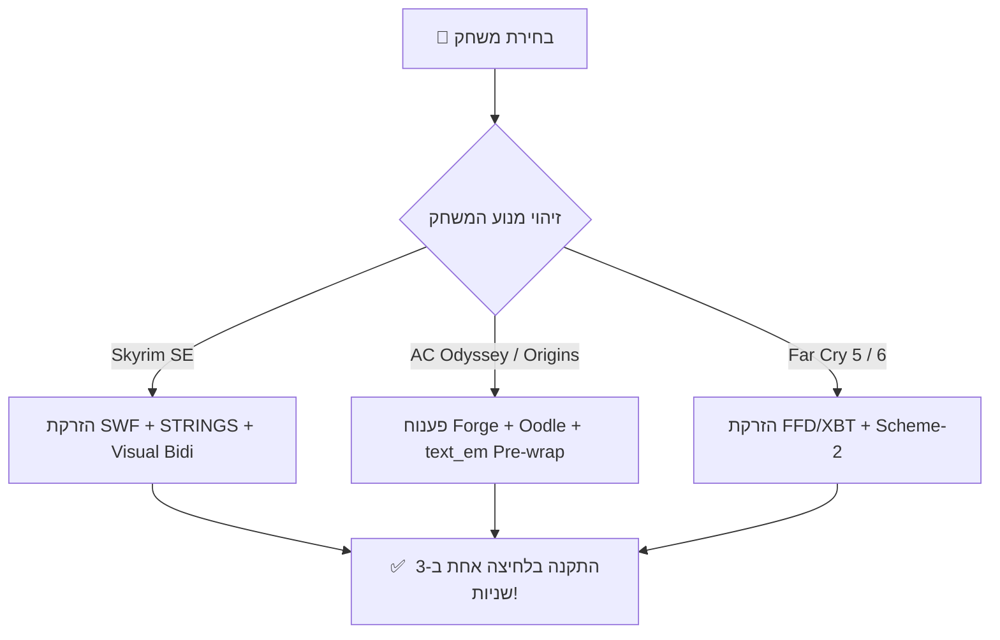

---

## 6. קטגוריה 6: תרגום בזמן אמת ובינה מלאכותית (NPU & Fleet)

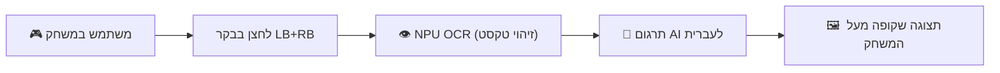

---

## 7. קטגוריה 7: שליטה בחומרה, סוללה ו-Smart Launch

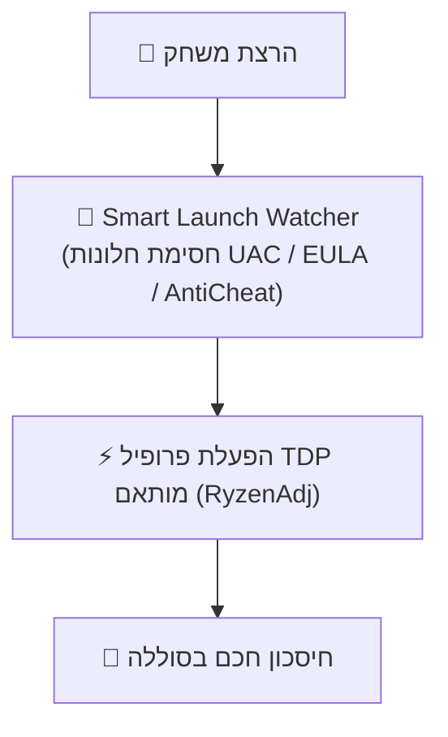

---

## 8. קטגוריה 8: 8 תרחישים ויזואליים עם חצים (Visual Scenarios)

### 🛒 תרחיש 1: קניית משחק -> התקנה -> תרגום בלחיצה אחת
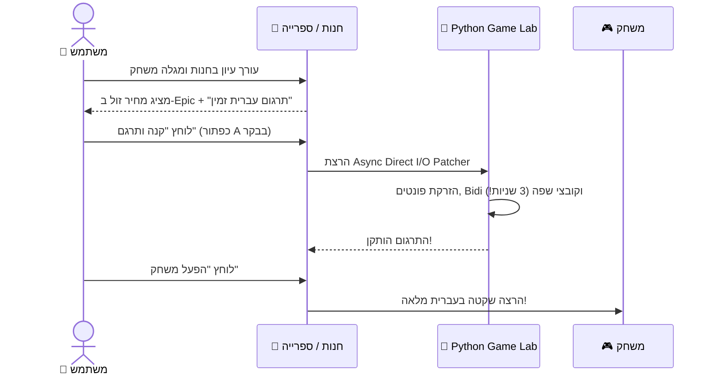

---

### 🤖 תרחיש 2: בדיקה אוטונומית ברקע (`dxcam`) לפני המשחק
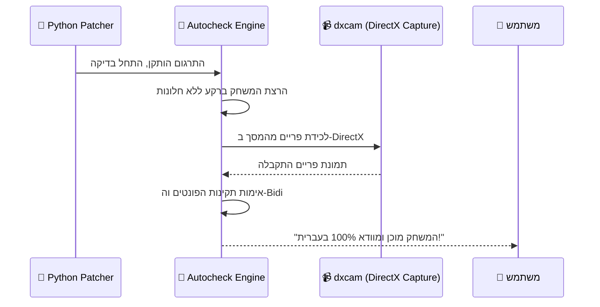

---

### 👁️ תרחיש 3: תרגום מסך בזמן אמת ב-NPU תוך כדי משחק
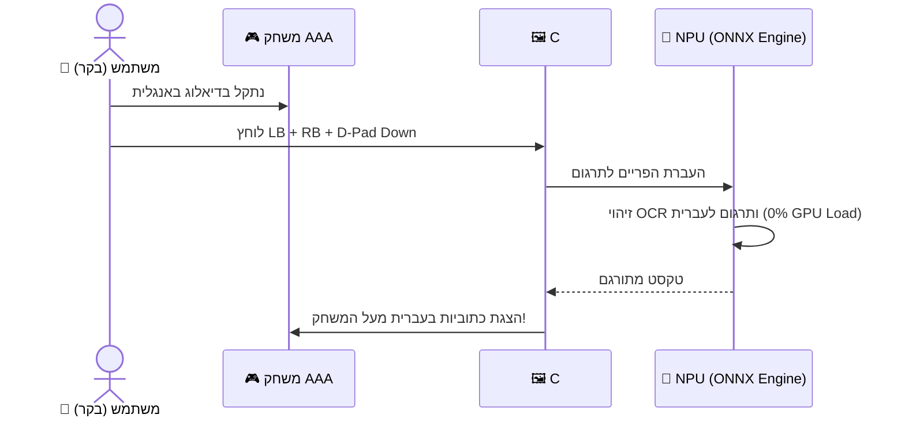

---

### 🚁 תרחיש 4: סנכרון צי התרגום (Fleet Ops) ואתר `/translate`
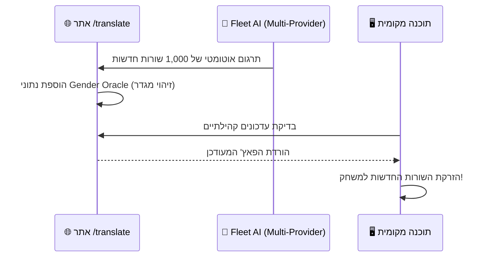

---

### 🧩 תרחיש 5: התקנת מודים ופתרון קונפליקטים ב-Game Lab
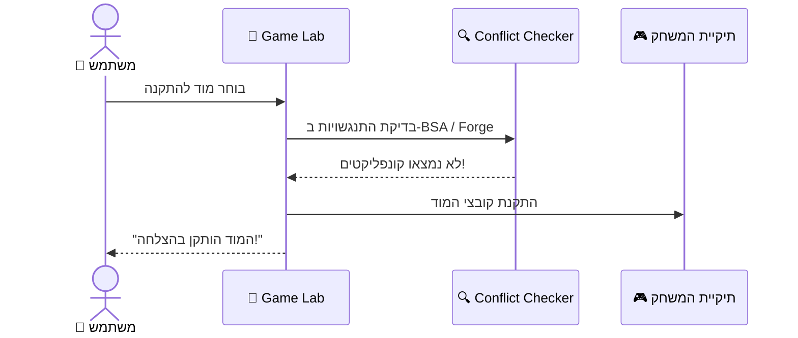

---

### 🧠 תרחיש 6: כניסה למשחק והקפאת זיכרון RAM
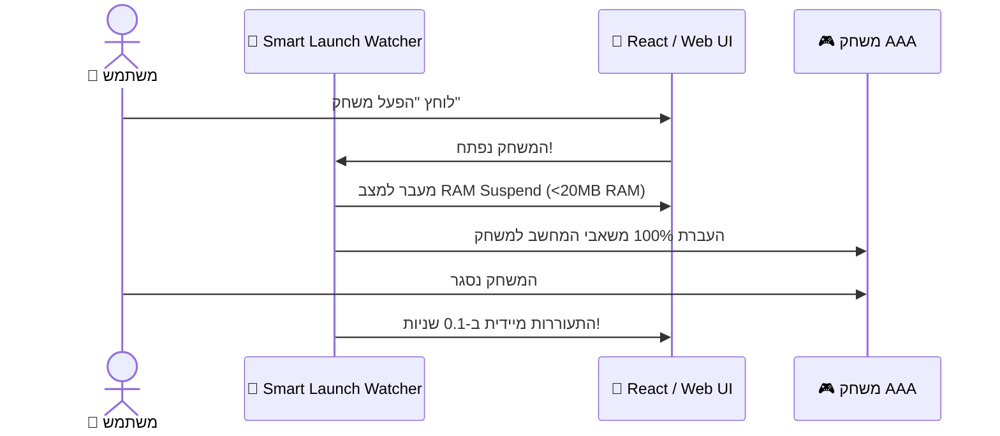

---

### ☁️ תרחיש 7: סנכרון ענן אוניברסלי (PC <-> Handheld)
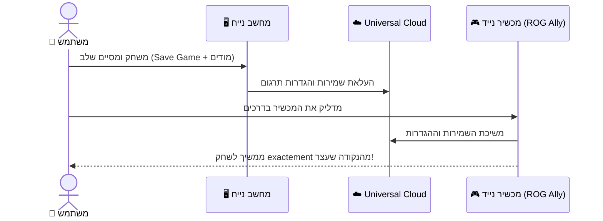

---

### 🎁 תרחיש 8: תפיסת משחקים חינמיים אוטומטית
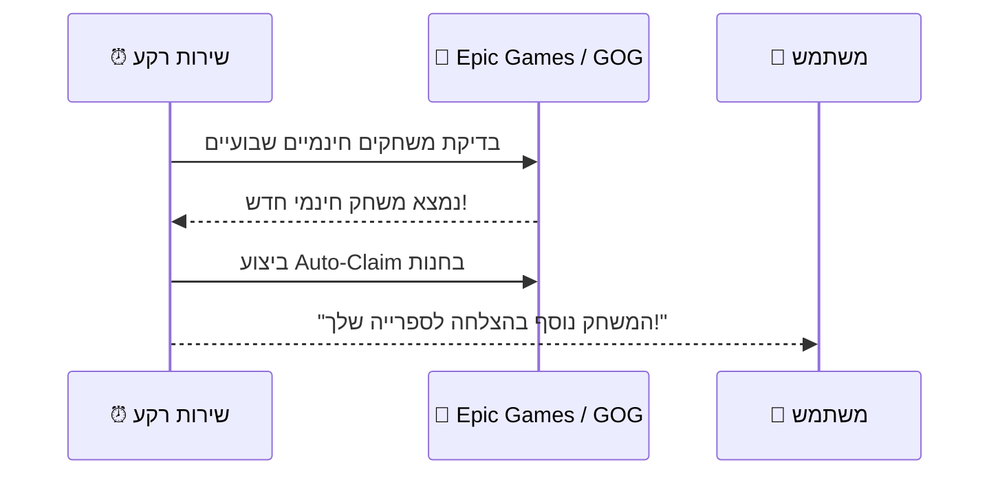

---

## 9. קטגוריה 9: סיכום מנהלים קצר

1. **אפס פשרות:** שומרים על **100% ממנועי התרגום וה-AI המתקדמים של TranslationManager**, ומרוויחים את **מצב הבקר, החנות וניהול החומרה של Winhanced**.
2. **מהירות שיא:** בזכות **הקפאת ה-RAM בזמן משחק (<20MB)** והזרקה ב-3 שניות, המשחקים רצים חלק ב-120 FPS.
3. **פלטפורמה אחת מושלמת:** פתרון מלא מקצה לקצה — מגילוי משחק ועד משחק בעברית מלאה בדרכים!

---

## 10. קטגוריה 10: טבלת השוואה מרכזית

| פיצ'ר / תכונה | TranslationManager | Winhanced | **הפלטפורמה המאוחדת** |
|---|---|---|---|
| **מנועי הזרקה למשחקי AAA (BSA, Forge, SWF, FFD)** | ✅ מתקדם ביותר | ❌ אין | ✅ **משולב מלא** |
| **צי תרגום AI (Fleet Ops) ואתר `/translate`** | ✅ קיים ופועל | ❌ אין | ✅ **סנכרון מלא** |
| **Gender Oracle (זיהוי מגדר)** | ✅ קיים | ❌ אין | ✅ **משולב אוטומטית** |
| **אימות אוטונומי ברקע (`dxcam`)** | ✅ קיים | ❌ אין | ✅ **בדיקה שקטה** |
| **מצב בקר מותאם (Handheld 10ft UI)** | ❌ אין | ✅ מצוין | ✅ **תמיכה מלאה בבקר** |
| **שליטה בחומרה (TDP / RyzenAdj / מאווררים)** | ❌ אין | ✅ מצוין | ✅ **שליטה מלאה בחומרה** |
| **חנות והשוואת מחירים (Cross-Store)** | ❌ אין | ✅ מותקן | ✅ **חנות השוואת מחירים** |
| **Smart Launch Watcher (חסימת חוסמים)** | ⚠️ חלקי | ✅ מתקדם | ✅ **מלא** |
| **חיסכון זיכרון בזמן משחק (RAM Suspend)** | ❌ אין | ⚠️ חלקי | ✅ **פחות מ-20MB RAM** |
| **תרגום מסך ב-NPU (Offline OCR)** | ❌ אין | ❌ אין | ✅ **0% ירידה ב-FPS** |
| **מהירות הזרקה (Async Direct I/O)** | ⚠️ רגיל | ❌ אין | ✅ **הזרקה ב-3 שניות** |
| **תקשורת מהירה (Shared Memory IPC)** | ⚠️ WebSockets | ❌ אין | ✅ **פחות מ-2ms** |
| **סנכרון ענן ושמירות (Cross-Cloud Sync)** | ⚠️ חלקי | ❌ אין | ✅ **סנכרון מלא** |
| **איסוף משחקים חינמיים אוטומטי** | ❌ אין | ❌ אין | ✅ **איסוף בלחיצה אחת** |

> [!IMPORTANT]
> **השורה התחתונה:** הפלטפורמה המאוחדת מעניקה לך את **המוצר המתקדם והמהיר ביותר בשוק**, המשלב את כל העוצמה ההנדסית של TranslationManager עם חוויית משתמש וביצועי קצה של Winhanced!
