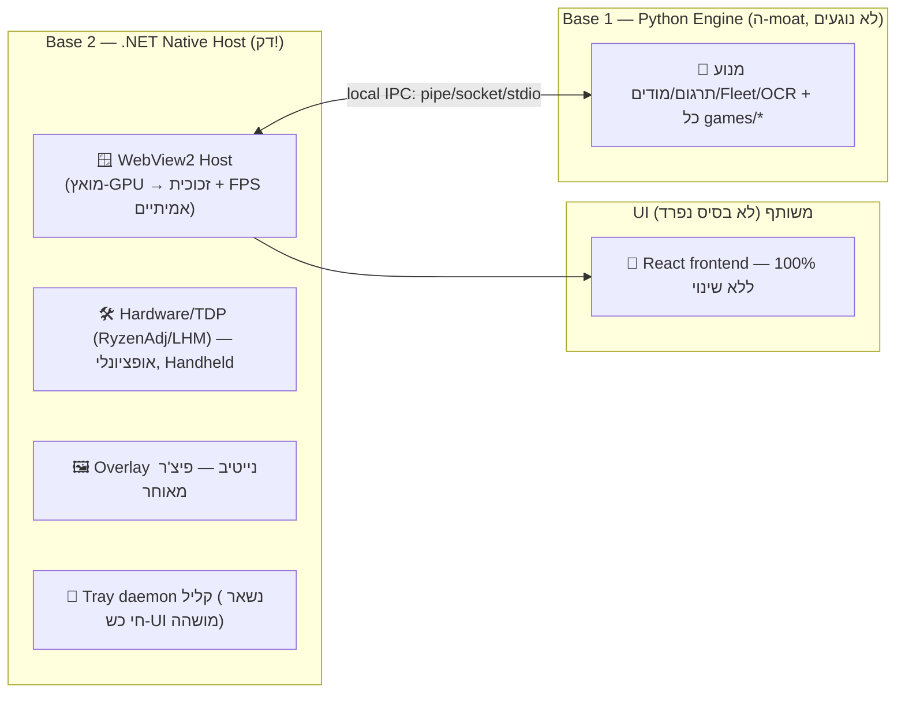
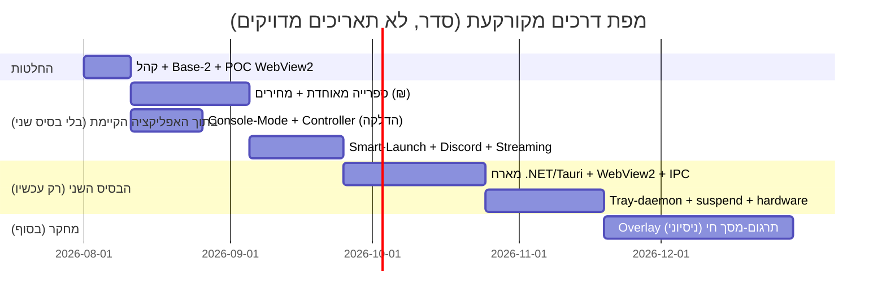

# 🎯 תוכנית-אב מקורקעת: הפלטפורמה המאוחדת (TranslationManager × Winhanced)

> **תאריך:** 31 ביולי 2026
> **מה זה:** ביקורת הנדסית + תוכנית ביצוע ריאלית שמאחדת ומחליפה את 5 מסמכי-התכנון הקודמים
> (`translation_manager_vs_winhanced_architecture_report.md`, `hybrid_nextgen_gaming_hub_blueprint.md`,
> `translation_manager_winhanced_master_blueprint2.md`, `winhanced_report.md`, `winhanced_servers_report.md`).
> **גישה:** בלי הייפ. מספרים אמיתיים, גבולות אמיתיים, וסדר עבודה שמשמר 100% ממה שכבר בנוי.

---

## 0. הפסיקה בפסקה אחת

הרעיון לאחד — **טוב ונכון**. איך המסמכים הקודמים מציעים לבצע אותו — **מסוכן ומנופח**.
הטעות המרכזית: הם מדברים על "שתי בסיסים" כאילו צריך לכתוב מחדש UI ב-WinUI 3 ולבנות מוצר בגודל של Winhanced.
זה מאמץ של שנים לצוות, לא לסולו. **הבסיס Python + מנוע התרגום שלך הוא ה-moat — לא נוגעים בו.**
מה שכן צריך זה **מארח נייטיב דק אחד** (C#/.NET) שנותן שלושה דברים שהסטאק הנוכחי (Qt WebEngine) לא נותן:
זכוכית אמיתית + FPS חלק (דרך WebView2 מואץ-GPU), שכבת-על/חומרה נייטיב, ותהליך-רקע קליל שנשאר חי כשה-UI מושהה.
**את ה-UI משאירים React כמו שהוא.** ככה מקבלים את יתרונות Winhanced בלי לזרוק כלום ובלי להתחרות בו במגרש שלו.

---

## 1. תיקוני-עובדות — מה במסמכים הקודמים לא מדויק

לפני שמתכננים, צריך לתקן טעויות שאם בונים עליהן — בונים על חול:

| טענה במסמכים | המצב האמיתי |
|---|---|
| "TranslationManager = Eel Bridge (WebSockets)" | ❌ ה-**production** רץ על **Qt WebEngine + QWebChannel** (`main_qt.py` + `bridge.py`). Eel הוא רק ה-dev-path. זה חשוב כי ה-FPS/זכוכית תלויים ב-Qt. |
| "הקפאת RAM ל-**פחות מ-20MB** בזמן משחק, התעוררות ב-0.1 שנ'" | ❌ מספר-פנטזיה. אפליקציית Chromium חיה לא יורדת ל-20MB. מה שכן אפשר: minimize-to-tray + `EmptyWorkingSet` (כבר קיים ב-`perf_manager`), ובהמשך daemon-רקע קטן נפרד. יעד אמיתי: ה-UI הכבד מושהה, נשאר תהליך קטן. |
| "הזרקת תרגום 100GB ב-**3 שניות**" | ❌ תלוי-מוד. חלק מהמודים באמת שניות, אבל מודים ששוכתבים ארכיוני-ענק לוקחים **דקות** (W3 מתעד ~6 דק' ב-CLAUDE.md). לא להבטיח 3 שניות. |
| "תרגום מסך NPU עם **0% ירידה ב-FPS**" | ❌ ל-OCR+MT+overlay יש עלות אמיתית, וצריך מודל OCR/MT לעברית. זה פיצ'ר-מחקר, לא "בלחיצה אחת". |
| "Shared Memory IPC — פחות מ-2ms" | ⚠️ נכון-אבל-חסר-משמעות. Local IPC רגיל (named-pipe/socket/stdio) הוא milliseconds ומספיק לחלוטין. אין צורך ב-shared-memory. |
| "אפשר להשיג את ה-UI של Winhanced" | ⚠️ **לא**. Winhanced קוד-סגור: אסור להעתיק את ה-UI, "Living Glass", המסקוט (Whinnie), או ה-Smart Profiles הקהילתי. **מותר** להשתמש באותם רכיבי-open מתחתיו (זה מה ש-`winhanced_servers_report.md` נכון מציין). |
| מחירי חנות ב-**$** | ⚠️ הקהל שלך דובר-עברית. השוואת מחירים צריכה ₪ ואזור IL. |

---

## 2. השאלה האסטרטגית הגדולה שחייבים לענות עליה קודם

שני ה-blueprints מניחים בשקט ש**הקהל הוא בעלי Handheld** (ROG Ally / Legion Go), עם TDP, מאווררים ו-10ft-UI.
אבל המוצר האמיתי שלך — TranslationManager — הוא **מרכז תרגום למשחקי PC לדוברי-עברית**, והמחשב שלך עצמו הוא **דסקטופ AMD RX 9070**, לא Handheld.

**זה מכתיב הכול:**
- **RyzenAdj/TDP/מאווררים** רלוונטיים כמעט רק ל-**APU של AMD בהתקנים ניידים**. על דסקטופ עם GPU נפרד — כמעט חסר-ערך.
- אם הקהל = דוברי-עברית שרוצים תרגומים על PC → ה-moat הוא **מנוע התרגום + הקהילה + `/translate` + הצי**, ופיצ'רי-Winhanced הם קישוט נחמד.
- אם הקהל = בעלי-Handheld → ה-TDP/console-mode הופכים למרכזיים, אבל אז אתה מתחרה ישירות ב-Winhanced/Playnite/מוצר בוגר.

**ההמלצה:** תישאר נאמן לזהות — **"מרכז התרגום + מודים + launcher לדוברי-עברית"** — ותוסיף מ-Winhanced רק את מה ש(א) זול דרך כלי-open, ו(ב) משרת גם משתמש-דסקטופ. Console-mode + controller = כן (כבר יש Big Picture כבוי בדגל). TDP/מאווררים = אופציונלי, מאחורי זיהוי-Handheld בלבד.

> אם הכיוון באמת Handheld-first — זו החלטת-מוצר לגיטימית, אבל צריך לומר אותה במפורש כי היא משנה 70% מסדר-העדיפויות למטה.

---

## 3. "שתי בסיסים" — הדרך הנכונה (ולמה לא WinUI 3)

### הארכיטקטורה שאני ממליץ עליה

- **Base 1 = Python** — כל מנוע התרגום, הזרקות ה-`games/*`, ה-Fleet, `/translate`, ה-community-compute. **אפס שינוי בליבה.**
- **Base 2 = מארח .NET דק** — תפקידו **לא** לצייר UI, אלא: (1) לארח את React ב-**WebView2** (Edge/Chromium מואץ-GPU) → `backdrop-filter` אמיתי + חלק; (2) חומרה/controller/overlay נייטיב; (3) daemon-tray שנשאר תושב.
- **ה-UI = React** — רוכב בתוך ה-WebView2 של Base 2. **לא בסיס שלישי**, אותו frontend קיים.
- Python רץ כ-**sidecar** שה-.NET מפעיל ומדבר איתו ב-IPC מקומי פשוט (JSON-RPC על named-pipe/localhost). לא shared-memory.

### למה WebView2 ולא Qt, ולמה לא WinUI 3

- **Qt WebEngine רץ עם `--disable-gpu-compositing`** — זה השורש המתועד של בעיות ה-FPS והזכוכית ב-CLAUDE.md (`backdrop-filter` הוסר כי הוא CPU-killer). **המעבר ל-WebView2 מואץ-GPU הוא המהלך היחיד בעל המנוף הגבוה ביותר** אם רוצים באמת "Living Glass + חלק" — והוא שומר 100% מה-frontend.
- **WinUI 3 = טעות** לפרויקט הזה: זורק את כל ה-frontend, ה-design-system, ה-RTL/עברית, ה-launcher-designer; דורש קימפול XAML על כל שינוי-עיצוב (הדוח הראשון עצמו מציין זאת); ונועל אותך ל-Windows-native. את מראה ה-"Living Glass" משיגים ב-CSS — הדוח הראשון אפילו נותן את ה-snippet.
- **מארח .NET+WebView2 הוא קטן** (WinForms/WPF עם קונטרול WebView2 = מאות שורות), והוא ממילא נקודת-הכניסה ה-C# שלך לחומרה/overlay/controller. זה בדיוק ה-"C# Host" של ה-blueprint — רק בלי ה-WinUI.

> **חלופה ל-.NET:** אפשר גם **Tauri (Rust) + WebView2** במקום .NET. אותו רווח (GPU, glass, אותו React), התקנה קטנה יותר, אבל את הקישור ל-RyzenAdj/PawnIO תעשה דרך crates/ctypes. אם ה-C# לא קדוש — Tauri הוא מועמד רציני. **החלטה זו היא ה-fork המרכזי של הפרויקט.**

---

## 4. מה לוקחים מ-Winhanced — ומה לא (פיצ'ר-אחר-פיצ'ר)

`winhanced_servers_report.md` כבר עשה חצי מהעבודה: רוב מה שמתחת ל-Winhanced הוא **open/ציבורי**. מה שסגור — לא משחזרים.

| פיצ'ר של Winhanced | לקחת? | איך (כלי-open) | עלות |
|---|---|---|---|
| ספרייה מאוחדת (Steam/Epic/GOG/Xbox/PS) | ✅ **כן** | הזיהוי כבר קיים ל-Steam/Ubisoft/Epic/GOG ב-`game_detector`. להרחיב + SteamKit2/APIs לא-רשמיים. | בינוני |
| השוואת מחירים cross-store | ✅ כן (ב-₪) | Steam Store API (ציבורי, בלי key) + ITAD; להימנע מ-scraping. | בינוני |
| Cover/Hero Art | ✅ כן | **SteamGridDB** + **IGDB** (חינם) — כבר יש covers ב-Supabase. | קל |
| Console-Mode / 10ft-UI + controller | ✅ **כן** | **כבר קיים!** Big Picture כבוי בדגל (`BIG_PICTURE_ENABLED=false`) + `spatialNav`/`gamepadMap`. להדליק + ללטש. | קל-בינוני |
| Smart Launch Watcher (חסימת UAC/EULA/AntiCheat) | ✅ כן | ה-JSON גלוי (רק הרעיון). Python + Win32 WinEvent hooks. יש כבר גרעין. | בינוני |
| Discord Rich Presence | ✅ כן | `pypresence` (לא Partner-SDK). | קל |
| PC Streaming (Moonlight/Sunshine/Chiaki) | ⚠️ אופציונלי | לא לבנות — רק **להפעיל/לזהות** Sunshine (Zeroconf) ולשגר Moonlight. | קל אם רק launcher |
| TDP/מאווררים (RyzenAdj/LHM/PawnIO) | ⚠️ רק Handheld | RyzenAdj+LibreHardwareMonitor מ-**Python** (Winhanced אפילו משלב `readjust.py`). דורש admin + kernel-driver. | גבוה, ROI תלוי-קהל |
| Sleep/Wake, Power-plan, FSE-Shell | ❌ דלג (בינתיים) | ספציפי-Handheld, ROI נמוך לדסקטופ. | — |
| אמולטורים (22+ פלטפורמות) | ⚠️ מאוחר | RetroArch/ES-DE rules ציבוריים. פיצ'ר גדול בפני עצמו. | גבוה |
| Smart Profiles קהילתיים | ❌ **אי-אפשר** | Backend סגור, נתוני-קהילה שלהם. **לא משחזרים.** | — |
| UI/"Living Glass"/מסקוט Whinnie | ❌ **אסור** | קוד-סגור + נכסים שלהם. בונים מראה-משלנו ב-CSS. | — |
| Auto-claim משחקים חינמיים | ⚠️ **סיכון ToS** | אוטומציה של חשבון-חנות עלולה להוביל לחסימה. לכל-היותר **התראה**, לא claim אוטומטי. | סיכון |
| שכבת-על תרגום-מסך חי (OCR) | ⚠️ **מחקר** | ראה §6. הפיצ'ר הכי יקר וספקולטיבי. | גבוה מאוד |

**מה Winhanced אין ולך יש (ה-moat — להשקיע פה!):** מנוע הזרקה למשחקי-AAA (BSA/Forge/SWF/FFD/Oodle), צי-AI רב-ספקי, `/translate` קהילתי, Gender-Oracle, אימות-אוטונומי `dxcam`, community-compute. **זה מה שמייחד אותך — לא שליטת-TDP.**

---

## 5. מפת-דרכים ריאלית — מדורגת, זול-ובעל-ערך קודם

הרעיון: **רוב הערך של "האיחוד" מושג בלי בסיס שני בכלל.** מוסיפים .NET רק כשמגיעים לזכוכית/overlay/daemon.

### שלב 0 — החלטות (שבוע)
- לקבוע קהל: Handheld-first או Desktop-Hebrew-first (§2). זה נועל את סדר-העדיפויות.
- לקבוע Base-2: **.NET+WebView2** או **Tauri+WebView2** (§3).
- POC קטן: לארח את ה-React הקיים בתוך WebView2 ולבדוק שהזכוכית + ה-FPS באמת משתפרים מול Qt. **לפני שמתחייבים — למדוד.**

### שלב 1 — ספרייה + חנות בתוך האפליקציה הקיימת (Python+Web, בלי בסיס שני)
- להרחיב `game_detector` לספרייה מאוחדת אמיתית (Steam/Epic/GOG/Xbox/PS).
- השוואת-מחירים ב-₪ (Steam Store API + ITAD), Art מ-SteamGridDB/IGDB.
- לחבר את זה לקטלוג/Supabase הקיים.

### שלב 2 — Console-Mode + Controller (ROI הכי גבוה, כמעט-חינם)
- **להדליק Big Picture** (`BIG_PICTURE_ENABLED`), ללטש ניווט-סטיק, למפות כפתורי-Guide, פרופיל בקר.
- זה כבר 80% בנוי — רק כבוי.

### שלב 3 — Smart Launch + Discord + Streaming-launch (Python)
- Smart Launch Watcher (Win32 hooks) לחסימת UAC/EULA/AntiCheat.
- `pypresence` ל-Rich Presence.
- זיהוי Sunshine (Zeroconf) + שיגור Moonlight.

### שלב 4 — הבסיס השני: מארח נייטיב (רק עכשיו!)
- לבנות את מארח ה-.NET/Tauri + WebView2, להעביר אליו את ה-React, Python כ-sidecar על IPC.
- Tray-daemon קליל; suspend-to-tray אמיתי.
- **רק כאן** לגעת ב-hardware/TDP (אם Handheld) ובתשתית-overlay.

### שלב 5 — פיצ'רים כבדים/מחקר (אופציונלי, בסוף)
- שכבת-על תרגום-מסך חי (§6), אמולטורים, סנכרון-ענן.

> שים לב: שלבים 1-3 כולם **Python+Web** — ערך אמיתי ומיידי בלי המורכבות של שני-runtimes. הבסיס השני מגיע רק בשלב 4.

---

## 6. שכבת-על תרגום-מסך חי — למה זה שדה נפרד (ולא לבלבל עם המוצר)

זה הפיצ'ר הכי נוצץ בכל ה-blueprints, ולכן צריך למקם אותו נכון:

- **הוא לא אותו דבר** כמו התרגום שלך היום. היום אתה מתרגם **offline, באיכות גבוהה, אפוי לתוך המשחק** (כל CLAUDE.md). OCR-overlay חי הוא MT באיכות נמוכה יותר, בזמן-אמת, מעל המשחק. **משלימים — לא מחליפים.**
- **קשה באמת:** לכידת פריים ב-exclusive-fullscreen (dxcam עובד אבל CLAUDE.md מתעד frame שחור במצבים מסוימים) → OCR של שפת-המקור → MT לעברית → ציור overlay שקוף בלי לשבור **EAC/BattlEye** (הזרקת overlay למשחק מוגן-אנטי-צ'יט = סיכון חסימה) → מהיר מספיק.
- **מודל לעברית:** צריך OCR (Tesseract/WinAI TextRecognizer) + MT — הרבה מודלים חלשים בעברית.
- **המלצה:** שלב 5, ניסיוני, מסומן במפורש כ-"beta/מחקר", ורק על משחקים **בלי אנטי-צ'יט**. לא להבטיח אותו כפיצ'ר-דגל.

---

## 7. סיכונים משפטיים ו-ToS — לומר בפה מלא

| נושא | סיכון | מה עושים |
|---|---|---|
| העתקת UI/נכסים של Winhanced | הפרת-זכויות (קוד סגור) | בונים מראה-משלנו ב-CSS. לא נוגעים בנכסים/מסקוט/Smart-Profiles. |
| Auto-claim משחקים חינמיים | חסימת חשבון-חנות (אוטומציה) | **התראה בלבד**, לא claim אוטומטי. |
| APIs לא-רשמיים (Epic/GOG/PSN) | שינוי/חסימה בלי התראה, אפור-ToS | להסתמך על ציבורי-רשמי (Steam) קודם; לא-רשמי כ-best-effort עם fallback. |
| kernel-driver (PawnIO) ל-TDP | דורש admin/חתימה, קרש-פוטנציאלי | רק בענף Handheld, מאחורי opt-in, עם guard. |
| Overlay מעל משחק מוגן-EAC | חסימה/ban | רק משחקים בלי אנטי-צ'יט. |
| Steam price API / scraping | חנויות מגבילות rate/scraping | API רשמי בלבד, cache, rate-limit. |

---

## 8. מדדים ריאליים (במקום ה-hype)

| טענת-blueprint | יעד אמיתי לשים במקומו |
|---|---|
| "<20MB RAM בזמן משחק" | UI כבד מושהה ל-tray; daemon קטן נשאר. RAM של ה-daemon בעשרות-MB, לא 20 של הכול. |
| "IPC פחות מ-2ms" | Local IPC ב-milliseconds — לא מדד-שיווק, פשוט "לא מורגש". |
| "הזרקה ב-3 שניות ל-100GB" | תלוי-מוד: שניות עד דקות. לדווח את הזמן האמיתי per-mod. |
| "0% ירידת FPS ב-OCR" | overlay צורך משאבים; היעד = "שמיש", לא "אפס". |
| "120 FPS מובטח" | ה-launcher לא קובע FPS של המשחק. היעד = footprint נמוך ברקע. |
| הזכוכית/FPS של ה-UI עצמו | היעד האמיתי: WebView2 מואץ-GPU → `backdrop-filter` חלק (מה ש-Qt לא נותן). **זה מדיד ב-POC של שלב 0.** |

---

## 9. סיכום — שורה תחתונה

1. **לאחד — כן. לכתוב-מחדש — לא.** ה-Python-engine הוא ה-moat; משאירים אותו שלם.
2. **"שתי בסיסים" = Python (מנוע) + מארח נייטיב דק (WebView2, .NET או Tauri).** ה-UI נשאר React, משותף. **לא WinUI 3.**
3. **רוב הערך מושג בלי הבסיס השני** (שלבים 1-3: ספרייה, מחירים, console-mode, smart-launch — כולם Python+Web). הבסיס השני נכנס רק כשמגיעים לזכוכית-אמיתית/overlay/daemon.
4. **קודם לקבוע קהל** (Handheld מול Desktop-Hebrew) — זה נועל 70% מסדר-העדיפויות. TDP/מאווררים רלוונטיים כמעט-רק ל-Handheld.
5. **מ-Winhanced לוקחים את מה שזול-דרך-open ומשרת-דסקטופ; לא מתחרים בו ב-Smart-Profiles/UI הסגורים.**
6. **המנוף היחיד הכי גבוה לחוויית "Living Glass + חלק": POC של WebView2 מול Qt בשלב 0 — למדוד לפני שמתחייבים.**
7. **תרגום-מסך-חי (OCR) = מחקר בסוף, לא פיצ'ר-דגל, ולא לבלבל עם התרגום-offline האיכותי שכבר יש.**

> הכיוון שלך נכון — רק צריך למקד אותו: פחות "לשכפל את Winhanced", יותר "מרכז-התרגום העברי הכי טוב שגם יודע להיות launcher מעולה". וזאת החלטה של קהל + POC אחד קטן, לא של rewrite.
