# 🚀 תוכנית-אב חזותית: השילוב המלא — TranslationManager × Winhanced

> **תאריך:** 31 ביולי 2026
> **חזון:** לשמור על ה-DNA של **TranslationManager** (העיצוב שלך + התקנת המודים שלך + הממשק שלך + קניית משחקים)
> ולצקת לתוכו את **כל** יתרונות **Winhanced** — ברמה הכי גבוהה, לא משנה כמה עבודה.
> **סגנון:** עברית קצרה וקולעת, הרבה תרחישים חזותיים עם חצים.

---

## 📋 תוכן

1. [ההבדל בבסיס הפיתוח (התוכנה שלך מול שלהם)](#1)
2. [עקרון השילוב — מה נשמר ומה מתווסף](#2)
3. [הארכיטקטורה המשולבת (שתי בסיסים + UI משותף)](#3)
4. [איך זה ייראה — מסך אחר מסך](#4)
5. [ביצועים — למה השילוב מהיר יותר](#5)
6. [13 תרחישים חזותיים עם חצים](#6)
7. [שיפורים חדשים שנולדים רק מהשילוב](#7)
8. [סיכום + טבלה מרכזית](#8)

---

## 1. ההבדל בבסיס הפיתוח — התוכנה שלך מול שלהם

`C:\Program Files\Translation Manager\TranslationManager.exe` בנויה אחרת לגמרי מ-Winhanced. זה בדיוק מה שקובע איך מחברים אותן:

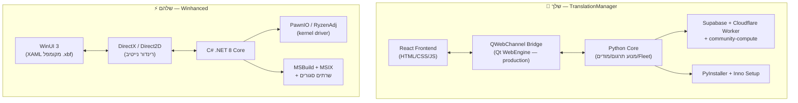

| רכיב | 🐍 שלך (TranslationManager) | ⚡ שלהם (Winhanced) | מה זה אומר לשילוב |
|---|---|---|---|
| **שפת ליבה** | Python 3 | C# (.NET 8) | שתי שפות → נחברן ב-IPC מקומי, לא מאחדים לשפה אחת |
| **ממשק (UI)** | React / Web (CSS גמיש) | WinUI 3 (XAML מקומפל) | ה-Web שלך **גמיש ונייד** → נשאר, מתארח מחדש |
| **מנוע רינדור** | Qt WebEngine (Chromium, GPU-compositing כבוי) | DirectX נייטיב | **פה החולשה** → מעבר ל-WebView2 מואץ-GPU |
| **גשר** | QWebChannel (prod) / Eel (dev) | in-process מנוהל | Python נשאר sidecar, מדבר עם מארח נייטיב |
| **חומרה** | ספריות עיליות (ctypes) | P/Invoke ל-kernel | חומרה נכנסת דרך מארח נייטיב (רק Handheld) |
| **אריזה** | PyInstaller + Inno | MSBuild + MSIX | אריזה משולבת: installer אחד שאורז את שניהם |
| **חוזק-על** | **מנוע הזרקה ל-AAA + Fleet + `/translate`** | **מעטפת נייטיב + חומרה + ספרייה** | כל אחד מביא את החוזק שלו — לא מתחרים |

> **השורה:** שתי התוכנות **משלימות מושלם** — שלך חזקה בעיבוד/תרגום/מודים/AI, שלהם חזקה בנייטיב/חומרה/בקר/ספרייה. אין חפיפה שמכריחה לוותר על משהו.

---

## 2. עקרון השילוב — מה נשמר ומה מתווסף

ה-DNA שלך נשאר **הבסיס**; יתרונות Winhanced נצקים מסביבו:

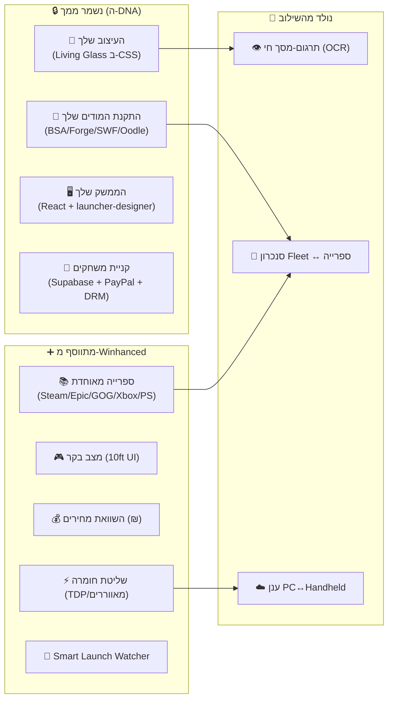

**הכלל:** אף פיצ'ר של Winhanced לא דורש לוותר על משהו שלך. הכול **תוספת**.

---

## 3. הארכיטקטורה המשולבת — שתי בסיסים + UI משותף

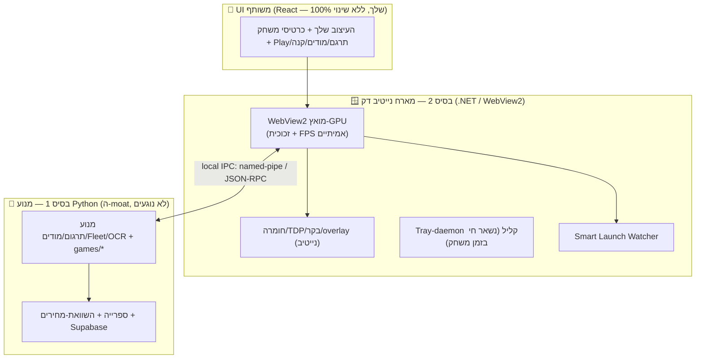

* **בסיס 1 (Python):** כל מנוע התרגום, המודים, ה-Fleet, `/translate`, ה-community-compute — **אפס שינוי**.
* **בסיס 2 (.NET דק):** מארח את ה-React ב-WebView2 (מתקן את בעיית ה-FPS/זכוכית של Qt), ונותן חומרה/בקר/overlay/daemon.
* **UI (React):** נשאר שלך במלואו, רוכב בתוך WebView2. **לא WinUI 3.**

---

## 4. איך זה ייראה — מסך אחר מסך

### 4.1 מרכז + ספרייה מאוחדת
- כרטיס לכל משחק עם **תמונת HD** (SteamGridDB/IGDB), **תג תרגום** ("בעברית" / "זמין בלחיצה" / "מודים מותקנים"), **תג ביצועים** (דירוג FPS צפוי במכשירך).
- מקורות: Steam + Epic + GOG + Xbox + PS + אמולטורים — **מסך אחד**.

### 4.2 כרטיס משחק מורחב (Game Hub) — ה-DNA שלך
- **הפעל משחק** (בולט) · **תרגם לעברית** (בלחיצה — המנוע שלך) · **ניהול מודים** (Game Lab שלך) · **קנה** (השוואת-מחירים ₪ אם לא מותקן).

### 4.3 שני מצבי-תצוגה (זיהוי אוטומטי)

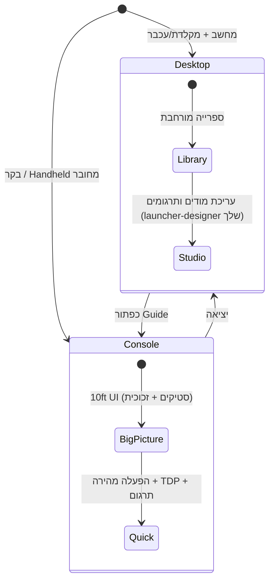

> **בונוס:** Big Picture כבר בנוי אצלך (`BIG_PICTURE_ENABLED`) — רק כבוי בדגל. ההדלקה כמעט-חינם.

### 4.4 שכבת-על תוך משחק (In-Game Overlay)
- נפתחת בכפתור Guide/Xbox: **TDP + מאווררים בלייב**, **תרגום-מסך חי (OCR)**, **FPS/חומרה (RTSS)**.

### 4.5 הגדרות
- ההגדרות שלך (עיצוב/אנימציה/נתיבי-EXE) **+** לשוניות Winhanced: Controller, Performance (TDP), Integrations (Discord/Streaming), Update Center.

---

## 5. ביצועים — למה השילוב מהיר יותר (ומספרים אמיתיים)

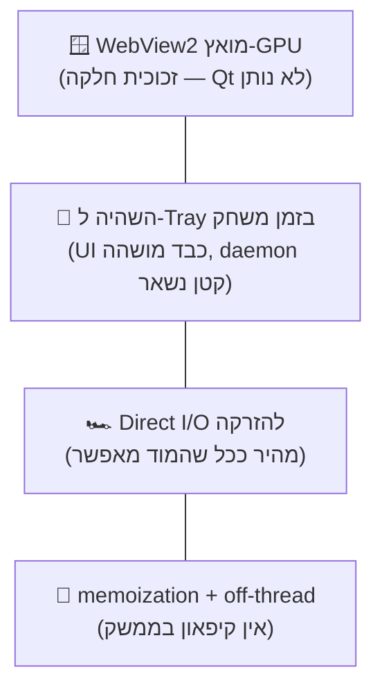

| שיפור | מה זה נותן | **יעד ריאלי** (לא הייפ) |
|---|---|---|
| **WebView2 מואץ-GPU** | זכוכית + אנימציה חלקה | ה-`backdrop-filter` עובד באמת (Qt חסם אותו) — **מדיד ב-POC** |
| **השהיה ל-Tray בזמן משחק** | פחות RAM/CPU ברקע | ה-UI הכבד מושהה; נשאר daemon בעשרות-MB (לא "<20MB לכול") |
| **Direct I/O להזרקה** | התקנת תרגום מהירה | שניות עד דקות **לפי המוד** (W3 ~6 דק' — לא "3 שניות ל-100GB") |
| **off-thread + memoization** | ממשק לא קופא | פעולות כבדות ברקע (כבר קיים ב-`bridge.py`/`perf_manager`) |
| **overlay נייטיב** | תרגום-מסך תוך-משחק | "שמיש" — לא "0% FPS"; רק משחקים בלי אנטי-צ'יט |

---

## 6. תרחישים חזותיים עם חצים

### 🛒 תרחיש 1: גילוי → השוואת מחיר → קנייה → הופעה בספרייה
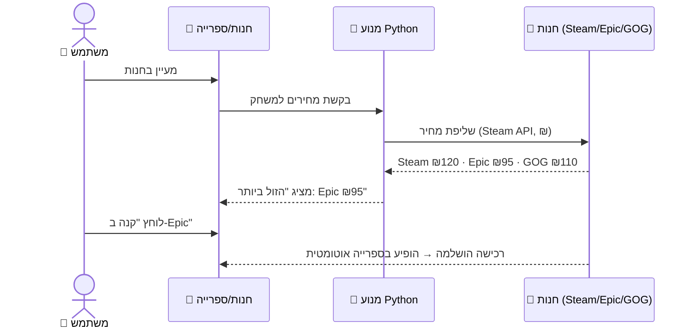

### 🌐 תרחיש 2: תרגום בלחיצה אחת (המנוע שלך)
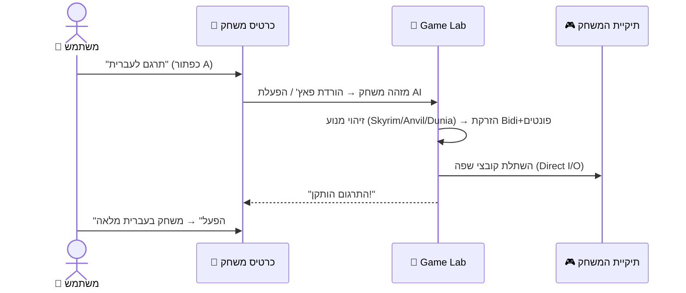

### 🎮 תרחיש 3: Handheld במצב בקר עם תרגום
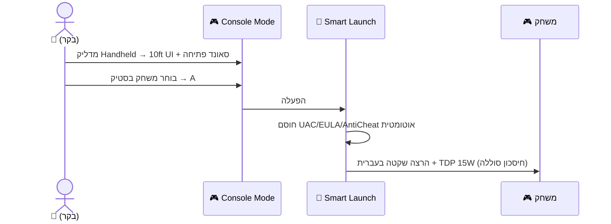

### 👁️ תרחיש 4: תרגום-מסך חי תוך-משחק (ניסיוני)
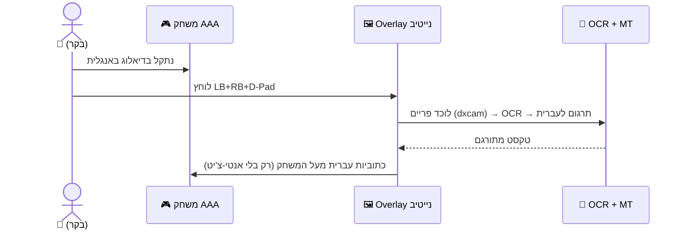

### 🚁 תרחיש 5: סנכרון Fleet ↔ אתר `/translate`
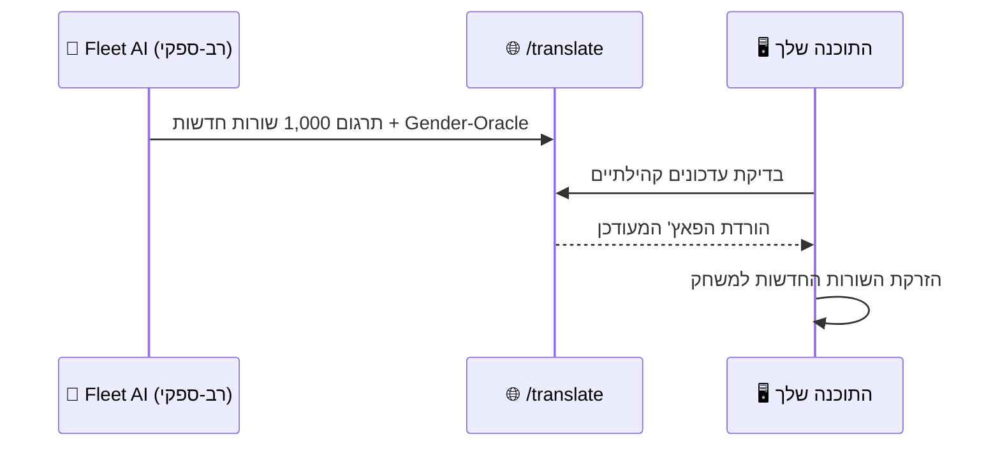

### 🧩 תרחיש 6: התקנת מוד + בדיקת קונפליקטים (Game Lab שלך)
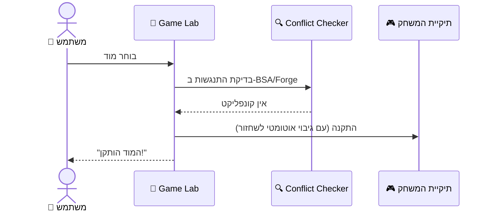

### 🧠 תרחיש 7: כניסה למשחק → השהיית UI ל-Tray
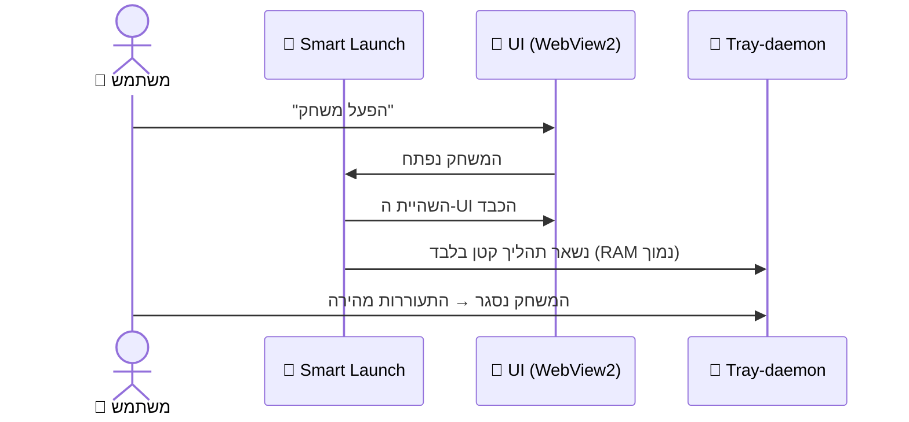

### ☁️ תרחיש 8: סנכרון ענן PC ↔ Handheld
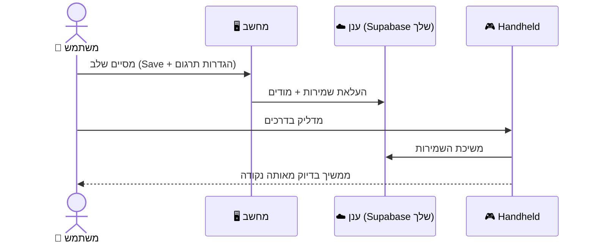

### 🤖 תרחיש 9: אימות אוטונומי ברקע (dxcam) לפני משחק
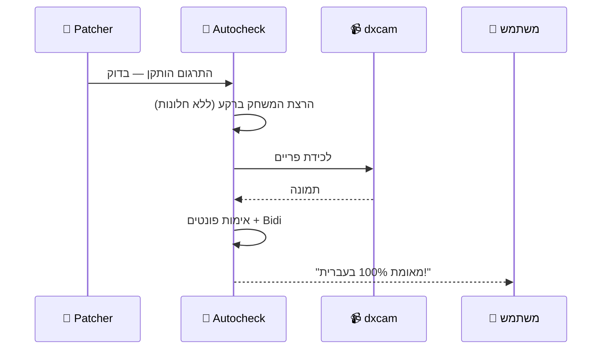

### ⚡ תרחיש 10: פרופיל TDP חכם בהפעלה (Handheld)
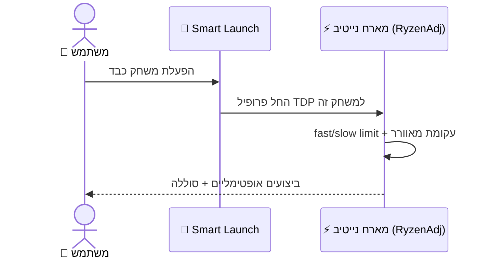

### 🎁 תרחיש 11: משחק חינמי — התראה (בלי auto-claim מסוכן)
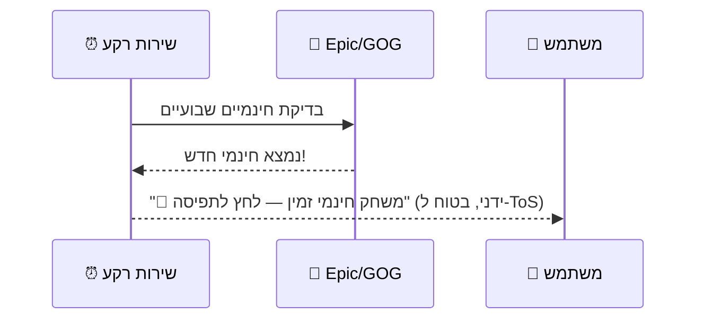

### 🕹️ תרחיש 12: ניווט מלא בבקר (Console Mode)
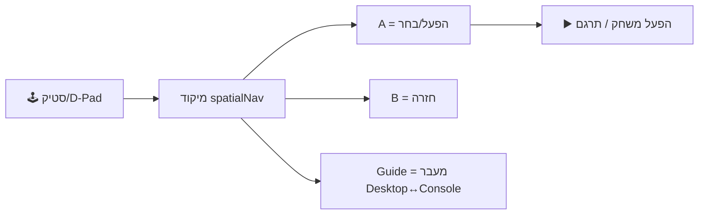

### 🟣 תרחיש 13: נוכחות Discord + חברים
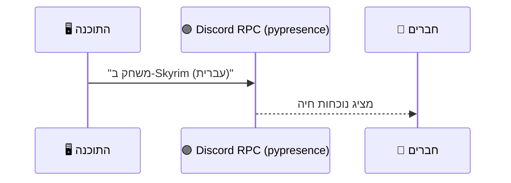

---

## 7. שיפורים חדשים שנולדים **רק** מהשילוב

דברים שאף אחת מהתוכנות לבד לא נותנת:

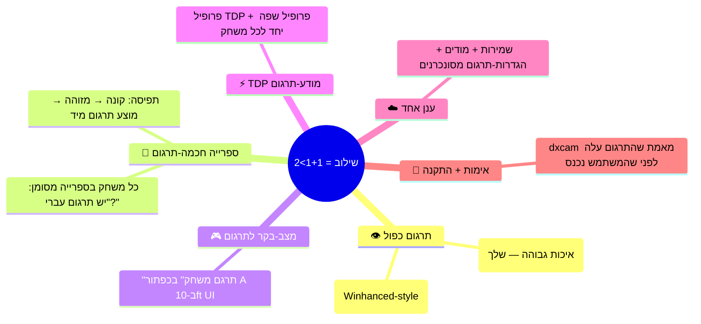

- **תרגום דו-שכבתי:** האפוי-offline האיכותי שלך **+** OCR-חי כגיבוי לשורות שלא תורגמו. אף אחד בשוק לא נותן את שניהם.
- **ספרייה מודעת-תרגום:** כל משחק מסומן אם יש לו תרגום עברי — Winhanced אין את המידע הזה, לך יש.
- **פרופיל כפול לכל משחק:** TDP + שפה נשמרים יחד ומופעלים אוטומטית.
- **תפיסת-קנייה:** קונה משחק → מזוהה בספרייה → **מוצע תרגום עברי מיד**.

---

## 8. סיכום + טבלה מרכזית

### סיכום קצר
1. **הבסיס שונה לגמרי** — שלך Python+Web (גמיש, חזק בעיבוד/תרגום), שלהם C#+WinUI (נייטיב, חזק בחומרה/בקר). **משלימים, לא מתחרים.**
2. **השילוב הנכון = שתי בסיסים + UI שלך:** Python (מנוע) + מארח נייטיב דק (WebView2 → זכוכית+FPS אמיתיים) + React (העיצוב שלך, ללא שינוי). **לא rewrite ל-WinUI 3.**
3. **ה-DNA שלך נשאר הבסיס:** עיצוב + מודים + ממשק + קניית משחקים — ומסביבו נצקים כל יתרונות Winhanced.
4. **הרבה ערך מגיע בלי הבסיס השני בכלל** (ספרייה, מחירים, Console-Mode שכבר בנוי) — הנייטיב נכנס רק לזכוכית/overlay/חומרה.
5. **שיפורים חדשים** (תרגום דו-שכבתי, ספרייה מודעת-תרגום, פרופיל כפול) נולדים **רק** מהשילוב.

### טבלה מרכזית

| פיצ'ר | 🐍 שלך לבד | ⚡ Winhanced לבד | 🌟 **המשולב** |
|---|---|---|---|
| **מנוע הזרקה AAA (BSA/Forge/SWF/Oodle)** | ✅ מתקדם | ❌ | ✅ **מלא** |
| **צי AI + `/translate` + Gender-Oracle** | ✅ | ❌ | ✅ **מסונכרן** |
| **אימות אוטונומי (dxcam)** | ✅ | ❌ | ✅ |
| **העיצוב שלך (launcher-designer)** | ✅ | ⚠️ סגור | ✅ **נשמר** |
| **קניית משחקים + DRM (Supabase/PayPal)** | ✅ | ⚠️ | ✅ **נשמר** |
| **ספרייה מאוחדת (Steam/Epic/GOG/Xbox/PS)** | ⚠️ חלקי | ✅ | ✅ **מלא** |
| **מצב בקר (10ft UI)** | ⚠️ כבוי בדגל | ✅ | ✅ **מודלק+לוטש** |
| **השוואת מחירים (₪)** | ❌ | ✅ | ✅ **מלא** |
| **שליטת חומרה (TDP/מאווררים)** | ❌ | ✅ | ✅ **(Handheld)** |
| **Smart Launch Watcher** | ⚠️ גרעין | ✅ | ✅ **מלא** |
| **Discord Presence** | ❌ | ✅ | ✅ |
| **Streaming (Moonlight/Chiaki)** | ❌ | ✅ | ✅ **שיגור** |
| **זכוכית + FPS חלק (UI)** | ⚠️ Qt חוסם | ✅ נייטיב | ✅ **WebView2 מואץ-GPU** |
| **השהיה ל-Tray בזמן משחק** | ⚠️ | ⚠️ | ✅ **daemon קטן** |
| **תרגום-מסך חי (OCR)** | ❌ | ❌ | 🌟 **חדש (ניסיוני)** |
| **ספרייה מודעת-תרגום** | ❌ | ❌ | 🌟 **חדש** |
| **פרופיל TDP+שפה כפול** | ❌ | ⚠️ TDP בלבד | 🌟 **חדש** |
| **סנכרון ענן PC↔Handheld** | ⚠️ | ⚠️ | ✅ **מלא** |

> **השורה התחתונה:** אתה שומר על **כל** מה שמייחד אותך (העיצוב, המודים, הממשק, הקנייה, מנוע-התרגום), מקבל **את כל** יתרונות Winhanced (ספרייה, בקר, מחירים, חומרה, streaming), ומרוויח **פיצ'רים חדשים שאף אחד בשוק לא נותן** — הכול בפלטפורמה אחת, על שתי בסיסים שמשלימים זה את זה במקום להתנגש.
