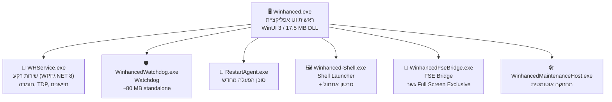
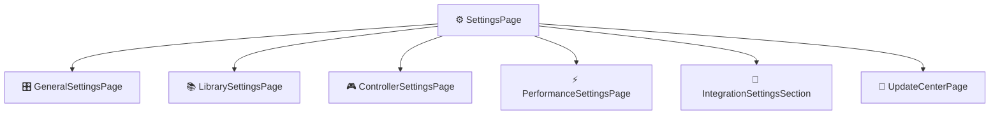
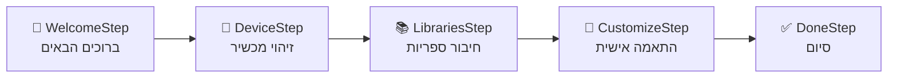
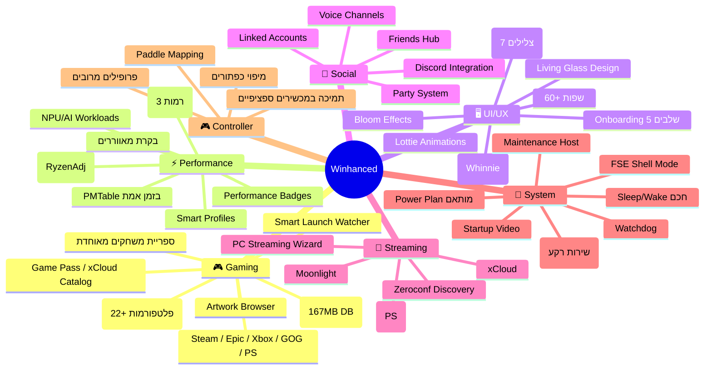

# 📋 דוח מקיף ומפורט על תוכנת Winhanced

> **גרסה שנבדקה:** `0.9.9.3` (Beta)
> **מיקום ההתקנה:** `C:\Program Files\Winhanced`
> **תאריך הדוח:** 30 ביולי 2026
> **פלטפורמה:** .NET 8.0 / WinUI 3 (Windows App SDK 2.0.1)

---

## 1. סקירה כללית — מהי Winhanced?

Winhanced היא **תוכנת Shell (מעטפת) מוכוונת-בקר למחשבי גיימינג ניידים (Handhelds)** על בסיס Windows. היא מספקת חוויה קונסולית מלאה — ממשק ויזואלי עשיר, ספריית משחקים מאוחדת, ניהול ביצועים דינמי בזמן אמת, שינה/השכמה חכמה, ועוד — כל זה דרך ממשק אחד ומוכן לשימוש בבקר.

> [!TIP]
> Winhanced מכוונת בעיקר למכשירים כמו **ASUS ROG Ally / Ally X**, **Lenovo Legion Go**, **MSI Claw**, **Steam Deck** (Windows), אך פועלת גם על כל PC Windows רגיל עם בקר.

---

## 2. ארכיטקטורה טכנית

### 2.1 טכנולוגיות ליבה

| רכיב | טכנולוגיה |
|---|---|
| **שפה** | C# (.NET 8.0) |
| **UI Framework** | WinUI 3 (Microsoft.WindowsAppSDK 2.0.1) |
| **XAML Compiled** | `.xbf` (XAML Binary Format) — כל הדפים ובקרי UI מקומפלים מראש |
| **מסד נתונים** | SQLite (עם SQLCipher הצפנה) |
| **אודיו** | NAudio (WASAPI, WinMM, ASIO, MIDI) |
| **חומרה** | LibreHardwareMonitorLib 0.9.6, PawnIO kernel driver |
| **GPU/Rendering** | ComputeSharp (D2D1), SharpDX (Direct3D9), Win2D |
| **רשת** | SteamKit2, AngleSharp (HTML parsing), Zeroconf (mDNS) |
| **Input** | HidLibrary, HidSharp, SDL3-CS, WindowsInput (InputSimulator) |
| **AI/ML** | Microsoft.ML.OnnxRuntime, Windows AI APIs (NPU detect) |
| **תצוגה** | WindowsDisplayAPI, DWM Scene Integration |
| **Protobuf** | protobuf-net (לתקשורת Steam) |
| **Discord** | Discord Partner SDK (discord_partner_sdk.dll) |
| **WebView** | Microsoft.Web.WebView2 |
| **אנימציות** | CommunityToolkit.WinUI.Lottie |
| **תמונות** | SixLabors.ImageSharp, libwebp |

### 2.2 רכיבי מערכת (Executables)



| קובץ הפעלה | תפקיד | גודל |
|---|---|---|
| [Winhanced.exe](file:///C:/Program%20Files/Winhanced/Winhanced.exe) | אפליקציית UI ראשית | ~383 KB (+ DLL ראשי 17.5 MB) |
| [WHService.exe](file:///C:/Program%20Files/Winhanced/whservice/WHService.exe) | שירות רקע — ניטור חומרה, TDP דינמי, בקרת מאווררים | ~150 KB (+ DLL 1.3 MB) |
| [WinhancedWatchdog.exe](file:///C:/Program%20Files/Winhanced/watchdog/WinhancedWatchdog.exe) | Watchdog — מוודא שהתוכנה פועלת | ~80 MB |
| [Winhanced-Shell.exe](file:///C:/Program%20Files/Winhanced/start/Winhanced-Shell.exe) | Shell Launcher — מפעיל עם סרטון אתחול | ~142 KB |
| [WinhancedFseBridge.exe](file:///C:/Program%20Files/Winhanced/WinhancedFseBridge.exe) | גשר Full Screen Exclusive | ~147 KB |
| [WinhancedMaintenanceHost.exe](file:///C:/Program%20Files/Winhanced/WinhancedMaintenanceHost.exe) | משימות תחזוקה אוטומטיות | ~147 KB |
| [RestartAgent.exe](file:///C:/Program%20Files/Winhanced/RestartAgent.exe) | סוכן הפעלה מחדש | ~78 KB |

### 2.3 מבנה תיקיות

```
C:\Program Files\Winhanced\
├── Assets/              ← אייקונים, תמונות, אנימציות, דרייברים, צלילים
│   ├── ControllerIcons/  ← אייקונים ספציפיים למכשירים (ROG Ally, Legion Go, MSI Claw...)
│   ├── Drivers/          ← PawnIO kernel driver (GPL-2.0)
│   ├── PerfBadges/       ← תגי ביצועים (bronze, silver, gold, platinum, diamond, poop)
│   ├── Power/            ← תוכנית צריכת חשמל מותאמת (Winhanced_powerplan.pow)
│   ├── RTSS/             ← שכבות-על של RTSS (RivaTuner) — 3 רמות + Dynamic TDP
│   ├── Sounds/           ← צלילי UI (ניווט, בחירה, הפעלה, שינה, השכמה, צילום מסך)
│   └── Whinne_animations/ ← אנימציות מסקוט (Whinnie) — WebP + MOV
├── Config/              ← קונפיגורציה (smart-launch-watcher.json)
├── Controls/            ← בקרי UI (כרטיסי משחק, Discord, Blade, חנות...)
├── Dialogs/             ← דיאלוגים (ייבוא משחקים, QR Login, Power Menu...)
├── Images/              ← אייקוני ספריות משחקים (Steam, Epic, GOG, PS, Xbox...)
├── Pages/               ← דפי ניווט (ספרייה, חברים, חנות, הגדרות, Onboarding...)
├── Plugins/             ← תוספים (Game Libraries — Epic כרגע)
├── Resources/           ← מאגרי נתונים (EmulatorRules, RomPlatforms, store_seed.db 167MB)
├── Views/               ← תצוגות (Overlay, Diagnostics, Game Details, Streaming...)
├── start/               ← Shell launcher + סקריפטי אתחול
├── watchdog/            ← Watchdog executable
├── whservice/           ← WHService (שירות חומרה)
└── [60+ locale dirs]    ← תרגומים (af-ZA עד zh-TW)
```

---

## 3. עיצוב ממשק המשתמש (UI Design)

### 3.1 שפת עיצוב — "Living Glass"

Winhanced משתמשת בשפת עיצוב ייחודית בשם **"Living Glass"** — עיצוב מודרני מבוסס **Glassmorphism** עם:

- **אפקט זכוכית (Acrylic/Mica)** — שקיפות ברקעים עם טשטוש
- **Bloom Canvas** — אפקטי זוהר דינמיים (כרטיס `BloomCanvas.xbf`)
- **GlassPillIndicator** — אינדיקטורי ניווט בסגנון כדורי זכוכית (22 KB — הבקר המורכב ביותר)
- **אנימציות Lottie** — אנימציות סרט מסך פתיחה ו-Mascot (Whinnie)
- **סאונד UI** — צלילי ניווט, בחירה, הפעלה, שינה והשכמה

### 3.2 רכיבי ממשק (UI Controls)

| בקר | תיאור |
|---|---|
| `AppTileCard` | כרטיס משחק/אפליקציה בספרייה |
| `BloomCanvas` | קנבס אפקטי זוהר |
| `BumperPillNavigation` | ניווט עם כפתורי LB/RB |
| `ChooseLibraryGrid` | רשת בחירת ספרייה |
| `ComboCard` | כרטיס combo |
| `ControllerProfileSelector` | בחירת פרופיל בקר |
| `FilterCard` / `StoreFilterCard` | כרטיס סינון |
| `FriendsTileCard` | כרטיס חבר |
| `GameOptionsPanel` | פאנל אפשרויות משחק |
| `GlassPillIndicator` | אינדיקטור ניווט "כדור זכוכית" |
| `NewsCard` | כרטיס חדשות |
| `PaddleMappingCanvas` | קנבס מיפוי Paddles |
| `SplashOverlay` | שכבת-על מסך פתיחה |
| `ToggleCard` | כרטיס מתג הפעלה/כיבוי |
| `VoiceChannelCard` | כרטיס ערוץ קולי Discord |

### 3.3 צלילי ממשק

| קובץ | שימוש |
|---|---|
| `Navigation_taps.wav` | ניווט בתפריטים |
| `Option_select.wav` | בחירת אפשרות |
| `Startup.wav` | צליל הפעלה |
| `back_plus_deadend.wav` | חזרה / מעבר לסוף |
| `camerashutter.wav` | צילום מסך |
| `device_sleep.wav` | כניסה לשינה |
| `wake_from_sleep.wav` | השכמה |

---

## 4. תכונות ופיצ'רים עיקריים

### 4.1 📚 ספריית משחקים מאוחדת (Unified Game Library)

Winhanced מאחדת משחקים מכל הפלטפורמות לממשק אחד:

| פלטפורמה | דפי הגדרות | מצב |
|---|---|---|
| **Steam** | `SteamSettingsPage`, `SteamSetupPanel`, `SteamQRLoginDialog` | ✅ מלא (כולל QR Login, SteamKit2) |
| **Epic Games** | `EpicSettingsPage`, `EpicSetupPanel` | ✅ מלא |
| **Xbox / Game Pass** | `XboxSettingsPage`, `XboxSetupPanel`, `GamePassCatalogPage` | ✅ מלא (כולל קטלוג Game Pass) |
| **GOG** | `GogSettingsPage`, `GogSetupPanel` | ✅ מלא |
| **PlayStation** | `PlayStationSettingsPage`, `PSNLoginDialog`, `PSRemotePlaySetupDialog` | ✅ מלא (כולל Remote Play) |
| **GeForce Now** | `GeForceNowSettingsPage`, `GeForceNowCaptureDialog` | ✅ ענן |
| **xCloud** | `XCloudCatalogPage`, `XCloudStreamWindow` | ✅ ענן |
| **אמולטורים** | `EmulatorsLibrarySettingsPage` | ✅ מקיף (ראה מטה) |
| **אפליקציות** | `AppsLibrarySettingsPage` | ✅ כל EXE |
| **אחר** | `OtherLibrarySettingsPage` | ✅ גנרי |

### 4.2 🎮 תמיכה מקיפה באמולטורים

מערכת הגדרות אמולטורים חכמה עם **זיהוי אוטומטי** מבוסס:
- **Registry** (HKLM/HKCU Uninstall keys)
- **AppX packages** (Microsoft Store)
- **PATH** (where.exe)
- **Static paths** (כולל EmuDeck, Scoop, WinGet, RetroBat)

#### אמולטורים נתמכים (מתוך [EmulatorRules.json](file:///C:/Program%20Files/Winhanced/Resources/EmulatorRules.json)):
RetroArch, RPCS3, Dolphin, PCSX2, PPSSPP, Cemu, Ryujinx, DuckStation, MAME, mGBA, melonDS, VisualBoyAdvance-M, Xemu, Project64, Snes9x, ScummVM, DOSBox-X, ועוד

#### פלטפורמות ROM נתמכות (מתוך [RomPlatforms.json](file:///C:/Program%20Files/Winhanced/Resources/RomPlatforms.json)):

| פלטפורמה | סיומות | ליבת RetroArch | Standalone |
|---|---|---|---|
| Game Boy | `.gb` | `gambatte_libretro.dll` | mgba, sameboy |
| Game Boy Color | `.gbc` | `gambatte_libretro.dll` | mgba, sameboy |
| Game Boy Advance | `.gba` | `mgba_libretro.dll` | mgba, VBA-M |
| Nintendo DS | `.nds` | `melonds_libretro.dll` | melonDS, DeSmuME |
| NES | `.nes` | `mesen_libretro.dll` | Mesen, FCEUX |
| SNES | `.sfc, .smc` | `snes9x_libretro.dll` | Snes9x |
| Nintendo 64 | `.n64, .z64` | `mupen64plus_next` | Project64 |
| Sega Genesis | `.gen, .md` | `genesis_plus_gx` | Blastem |
| Sega Game Gear | `.gg` | `genesis_plus_gx` | — |
| Sega Master System | `.sms` | `genesis_plus_gx` | — |
| PSP | `.iso, .cso, .chd` | `ppsspp_libretro.dll` | PPSSPP |
| TurboGrafx-16 | `.pce` | `mednafen_pce` | — |
| WonderSwan | `.ws, .wsc` | `mednafen_wswan` | — |
| Neo Geo Pocket | `.ngp` | `mednafen_ngp` | — |
| Atari 2600/5200/7800 | `.a26, .a52, .a78` | stella/prosystem/a5200 | Stella |
| ColecoVision | `.col` | `bluemsx_libretro.dll` | — |
| Amstrad CPC | `.dsk, .cpc` | `cap32_libretro.dll` | — |

### 4.3 ⚡ ביצועים ו-TDP דינמי

#### WHService — שירות חומרה ברקע

שירות `.NET 8.0` מבוסס WPF שרץ ברקע ומבצע:

- **ניטור חומרה בזמן אמת** via `LibreHardwareMonitorLib` + `PawnIO` kernel driver
- **Dynamic TDP** — התאמת צריכת חשמל דינמית למעבד AMD Ryzen via `libryzenadj`
- **בקרת מאווררים** — עקומות מאוורר מותאמות אישית לכל משחק
- **ניטור GPU** — תמיכה ב-AMD (ADLX), Intel (IGCL), ו-NVIDIA
- **RTSS Integration** — שכבות-על מותאמות של RivaTuner Statistics Server

#### RyzenAdj Integration (מתוך [readjustService.ps1](file:///C:/Program%20Files/Winhanced/readjustService.ps1)):

פרמטרים הניתנים לשליטה בזמן אמת:

| פרמטר | תיאור |
|---|---|
| `fast_limit` | PPT Fast Limit (W) |
| `slow_limit` | PPT Slow Limit (W) |
| `slow_time` | זמן מעבר PPT (שניות) |
| `tctl_temp` | מגבלת טמפרטורת CPU (°C) |
| `apu_skin_temp_limit` | מגבלת טמפרטורת APU Skin (°C) |
| `vrmmax_current` | מגבלת זרם VRM Max (mA) |
| `stapm_limit` | STAPM Limit (W) |
| `vrm_current` / `vrmsoc_current` | TDC VRM / SoC (mA) |
| `max/min_gfxclk_freq` | תדר GPU (MHz) |
| `max/min_socclk_freq` | תדר SoC (MHz) |
| `max/min_fclk_freq` | תדר Fabric (MHz) |
| `power_saving` / `max_performance` | מצבים |

#### נתוני חומרה בזמן אמת (PMTable):

הסקריפט [pmtable-example.py](file:///C:/Program%20Files/Winhanced/pmtable-example.py) מדגים גישה לטבלת PM של AMD — **560+ ערכים** מתעדכנים בזמן אמת כולל:

- STAPM Limit/Value
- PPT Fast/Slow Limit/Value
- APU Slow Limit/Value
- TDC VRM/SoC Current Limit/Value
- EDC VRM Max Limit/Value
- TCTL Temperature Limit/Value
- APU/dGPU Skin Temperature

#### תגי ביצועים (Performance Badges)

מערכת דירוג ביצועים חזותית:
- 🥉 Bronze
- 🥈 Silver
- 🥇 Gold
- 💎 Platinum
- 💠 Diamond
- 💩 Poop (ביצועים מאוד נמוכים)

#### שכבות-על RTSS (RivaTuner)

5 תבניות `.ovl` מותאמות:
- `Winhanced-Level-1/2/3.ovl` — 3 רמות מידע
- `Winhanced-DynamicTDP-1/2.ovl` — תצוגת TDP דינמי
- `WinhancedOverlayBridge.dll` — גשר תקשורת עם RTSS

### 4.4 🌊 Smart Launch Watcher

מערכת **מעקב חכם אחר הפעלת משחקים** (מתוך [smart-launch-watcher.json](file:///C:/Program%20Files/Winhanced/Config/smart-launch-watcher.json)):

#### יכולות:
- **WinEvent Hook** — מעקב אחר חלונות חדשים
- **Window Sweep** — סריקת חלונות כל 500ms
- **Process Tree** — מעקב עץ תהליכים כל 1500ms
- **Secure Desktop** — זיהוי שולחן עבודה מאובטח (UAC)
- **Foreground Window** — מעקב חלון פעיל כל 250ms

#### זיהוי חוסמים אוטומטי:

| קטגוריה | סוג | דוגמאות |
|---|---|---|
| **Redistributables** | DirectX, Visual C++, .NET Framework, PhysX, OpenAL | התקנות אוטומטיות בהפעלה ראשונה |
| **AntiCheat** | EasyAntiCheat, BattlEye | התקנות מערכת Anti-Cheat |
| **Cloud Save** | Steam Cloud Sync Conflict | קונפליקטים בסנכרון ענן |
| **Authentication** | Steam Sign In, Steam Guard, Epic Login | דרישות התחברות |
| **Modals** | EULA, Terms of Service, Age Verification, Errors | דיאלוגים חוסמים |
| **Launchers** | Steam, Epic, Rockstar Social Club, Ubisoft Connect, EA Desktop/Origin | חלונות launcher |

### 4.5 👥 Social / Friends Hub

- **FriendsPage** — דף חברים מרכזי
- **FriendsTileCard** — כרטיסי חברים
- **FriendDetailsPanel** — פרטי חבר
- **PartyCard** — כרטיס Party
- **LinkedAccountsCard** — חשבונות מקושרים

מציג **נוכחות חיה** מ-Steam, Xbox, PlayStation, ו-**Discord** (כולל `VoiceChannelCard`).

### 4.6 🟣 Discord Integration

אינטגרציה עמוקה עם Discord כולל:
- **Discord Partner SDK** (`discord_partner_sdk.dll` — 9.6 MB)
- דף Discord ייעודי (`DiscordPage`, `DiscordSettingsPage`)
- בקר `VoiceChannelCard` — כרטיסי ערוצי קול
- `DiscordFriendPickerDialog` — בחירת חבר Discord
- Fallback Banner ייעודי

### 4.7 🎮 PC Streaming

תמיכה מלאה ב-Streaming מ-PC:
- **Moonlight** — `MoonlightStreamWindow`, `SunshineCredentialsDialog`
- **Chiaki** — `ChiakiStreamWindow` (PS Remote Play)
- **xCloud** — `XCloudStreamWindow`
- **PC Streaming Setup Wizard** — אשף הגדרת Streaming מורחב (11 KB)
- **Zeroconf/mDNS** — גילוי מכשירים אוטומטי ברשת

### 4.8 🔄 Sleep/Wake חכם

אחד הפיצ'רים הבולטים:
- `WakeResumeSplash` — מסך השכמה ייעודי
- `device_sleep.wav` / `wake_from_sleep.wav` — צלילי שינה/השכמה
- כתיבה מחדש של נתיב השינה של Windows למניעת battery drain

### 4.9 🏪 חנות מובנית (Store)

- **StorePage** — דף חנות
- **StoreDetailPanel** — פרטי משחק
- **StoreGameTile** — כרטיס משחק בחנות
- **StoreToolbar** — סרגל כלים
- **store_seed.db** — מסד נתונים ראשוני **167 MB** (קטלוג Steam Games מבוסס Fronkon Games Dataset)
- **spine_seed.db** — מסד נתונים עמוד שדרה **27 MB**
- **GamePassCatalogPage** / **XCloudCatalogPage** — קטלוגי Game Pass ו-xCloud

### 4.10 🕹️ מיפוי בקרים (Controller Mapping)

- **ControllerProfileSelector** — בחירת פרופיל
- **PaddleMappingCanvas** — מיפוי Paddles חזותי
- **BindingPickerDialog** — בחירת מיפוי
- תמיכה במכשירים ספציפיים: ROG Ally, Legion Go, MSI Claw, Xbox, Steam Deck
- אייקונים ייעודיים לכל כפתור (A/B/LB/LT/RB/RT/Guide + כפתורים ייחודיים ל-Legion Go ו-ROG Ally)

### 4.11 📊 Diagnostics / GlassLab

- **GlassLabPage** — דף אבחון ובדיקות
- **ScalingTestPage** — בדיקת Scaling

---

## 5. הגדרות (Settings)

### 5.1 מבנה דפי הגדרות



| דף | תיאור |
|---|---|
| **General** | הגדרות כלליות — שפה, ערכת נושא, התנהגות מערכת |
| **Library** | ניהול ספריות — Steam, Epic, GOG, Xbox, PS, אמולטורים, אפליקציות |
| **Controller** | פרופילי בקר, מיפוי כפתורים, Paddles |
| **Performance** | TDP, מאווררים, RTSS overlay, Smart Profiles, Autopilot |
| **Integration** | Discord, חשבונות מקושרים, Streaming |
| **Update Center** | מרכז עדכונים (10.7 KB — הדף הגדול ביותר) |

### 5.2 Smart Profiles

מערכת **פרופילים חכמים** לכל משחק:
- **SmartProfilesWindow** — חלון ייעודי
- **SmartProfilesPage** — דף ניהול
- **SmartProfileDetailsPage** — פרטי פרופיל
- **SmartProfileItemView** — תצוגת פרופיל בודד

פרופילים קהילתיים שמחילים אוטומטית הגדרות אופטימליות (TDP, מאווררים, resolution) לכל משחק ומכשיר.

---

## 6. ניהול ותחזוקה

### 6.1 שירותים ומשימות מתוזמנות

| סקריפט | תפקיד |
|---|---|
| [AddAppStartup.bat](file:///C:/Program%20Files/Winhanced/start/AddAppStartup.bat) | הוספת Winhanced לאתחול אוטומטי (Task Scheduler) |
| [RemoveAppStartup.bat](file:///C:/Program%20Files/Winhanced/start/RemoveAppStartup.bat) | הסרה מאתחול |
| [EnableFSEShell.bat](file:///C:/Program%20Files/Winhanced/start/EnableFSEShell.bat) | הפעלת מצב FSE Shell (סרטון אתחול + Winhanced) |
| [DisableFSEShell.bat](file:///C:/Program%20Files/Winhanced/start/DisableFSEShell.bat) | כיבוי מצב FSE Shell |
| [installServiceTask.bat](file:///C:/Program%20Files/Winhanced/installServiceTask.bat) | התקנת שירות RyzenAdj כ-Scheduled Task |
| [uninstallServiceTask.bat](file:///C:/Program%20Files/Winhanced/uninstallServiceTask.bat) | הסרת שירות RyzenAdj |

### 6.2 WinhancedMaintenanceHost

רכיב תחזוקה אוטומטי שמבצע:
- ניקוי cache
- בדיקות שלמות
- עדכון מסדי נתונים

### 6.3 Watchdog

`WinhancedWatchdog.exe` (~80 MB) — מוודא שהתוכנה הראשית ושירות WHService פועלים. מפעיל מחדש אוטומטית במקרה קריסה.

### 6.4 Update Center

דף עדכונים מקיף (`UpdateCenterPage` — 10.7 KB, הדף הגדול ביותר) עם `UpdateSelectorControl` לניהול גרסאות.

---

## 7. Onboarding — חוויית הגדרה ראשונית



5 שלבים מודרכים:
1. **Welcome** — הצגת Winhanced
2. **Device** — זיהוי סוג המכשיר (ROG Ally, Legion Go, MSI Claw...)
3. **Libraries** — חיבור Steam, Epic, Xbox, GOG, PlayStation
4. **Customize** — התאמה אישית (ערכת נושא, התנהגות)
5. **Done** — סיום והתחלת שימוש

---

## 8. Windows AI Integration

Winhanced כוללת אינטגרציה עם **Windows AI APIs** (NPU):

### Workloads נתמכים (מתוך [workloads.json](file:///C:/Program%20Files/Winhanced/workloads.json)):

| API | תיאור | Workload |
|---|---|---|
| `ImageForegroundExtractor` | חילוץ רקע מתמונות | ImageProcessing |
| `ImageObjectExtractor` | חילוץ אובייקטים | ImageProcessing |
| `ImageScaler` | שיפור רזולוציית תמונות | ImageProcessing |
| `ImageObjectRemover` | הסרת אובייקטים מתמונות | ImageTransform |
| `TextRecognizer` | זיהוי טקסט (OCR) | ContentExtraction |
| `ImageSearchEmbeddingsCreator` | חיפוש תמונות חכם | ImageSearch |

> [!NOTE]
> נוכחות NPUDetect.dll ומגוון קבצי `workloads.*.json` (365, j32, lnl, qnn, stx) מעידה על תמיכה במספר ארכיטקטורות NPU — Intel, Qualcomm (Snapdragon X), ו-AMD.

---

## 9. לוקליזציה ותמיכה בשפות

Winhanced תומכת ב-**60+ שפות**, כולל:

אפריקאנס, עמהרית, ערבית, בולגרית, קטלנית, צ'כית, דנית, גרמנית, יוונית, אנגלית (GB/US), ספרדית (ספרד/מקסיקו), אסטונית, פינית, פיליפינית, צרפתית (צרפת/קנדה), אירית, עברית, הינדי, הונגרית, אינדונזית, איטלקית, יפנית, קוריאנית, לטבית, ליטאית, מלאית, נורווגית, הולנדית, פולנית, פורטוגזית (ברזיל/פורטוגל), רומנית, רוסית, סלובקית, סרבית, שוודית, תאית, טורקית, אוקראינית, ויאטנמית, סינית (פשוטה/מסורתית), ועוד.

---

## 10. ספריות צד-שלישי ורישוי

### רישוי רכיבים עיקריים:

| רכיב | רישיון | תפקיד |
|---|---|---|
| **PawnIO** | GPL-2.0 | Kernel driver לקריאת חיישני חומרה |
| **LibreHardwareMonitorLib** | MPL-2.0 | ספריית ניטור חומרה |
| **Discord Partner SDK** | Discord Developer Terms | אינטגרציית Discord |
| **Steam Games Dataset** | MIT (Fronkon Games) | קטלוג חנות ראשוני |
| **SteamKit2** | LGPL | תקשורת עם שרתי Steam |
| **ONNX Runtime** | MIT | AI/ML inference |

---

## 11. סיכום — מפת תכונות



---

> [!IMPORTANT]
> **Winhanced** היא אחת התוכנות המקיפות ביותר בתחום ה-Handheld Gaming על Windows. היא משלבת **ממשק קונסולי יפהפה**, **ניהול ביצועים מתקדם בזמן אמת**, **ספריית משחקים מאוחדת מכל הפלטפורמות**, **אינטגרציה חברתית עמוקה**, ו-**מערכת תחזוקה אוטונומית** — הכל באפליקציה אחת שמתוכננת לעבוד עם בקר מהרגע הראשון.
