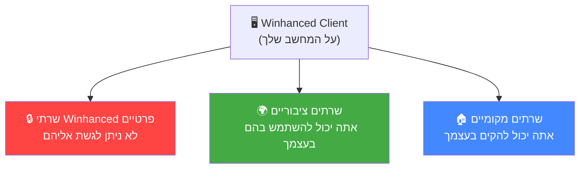
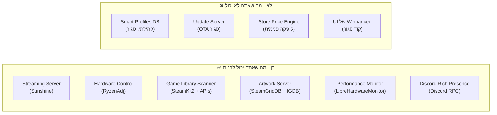

# 🌐 דוח שרתים ושירותים — Winhanced

> **תאריך:** 30 ביולי 2026 | **גרסה נבדקת:** 0.9.9.3

---

## סיכום מהיר

Winhanced היא **בעיקר אפליקציית צד-לקוח (Client-Side)** — רוב הפעולות קורות מקומית על המחשב שלך. עם זאת, היא מתחברת למגוון שרתים חיצוניים. הדוח הזה מפריד בין שלושה סוגים:



---

## 1. 🔒 שרתי Winhanced הפרטיים (לא נגיש לך)

אלה שרתים שהחברה/מפתח של Winhanced מפעילה ורק התוכנה שלהם ניגשת אליהם. **אין לך גישה ישירה אליהם** ולא תוכל להקים אותם בעצמך.

| שירות | מה הוא עושה | למה אתה לא יכול |
|---|---|---|
| **שרת עדכונים (OTA)** | מוריד גרסאות חדשות של Winhanced, בודק אם יש עדכון זמין | ה-API סגור, אין תיעוד ציבורי. הוא משרת רק את אפליקציית Winhanced |
| **Smart Profiles Backend** | מספק פרופילי ביצועים קהילתיים (TDP, מאווררים) לכל משחק ומכשיר | נתונים שנאספו ונאצרו ע"י הקהילה דרך Winhanced. אין API ציבורי |
| **שרת מטא-נתונים / Artwork** | שולף תמונות Cover Art, Hero Art, ומטא-נתונים של משחקים | ככל הנראה עובר דרך שרת proxy של Winhanced שמרכז מקורות שונים |
| **חנות מחירים (Store)** | השוואת מחירים cross-store (Steam, Epic, GOG, Xbox, Humble) | מבוסס על לוגיקה פנימית, ייתכן שמשלב store_seed.db מקומי עם עדכונים מרחוק |
| **Winhanced Account / Auth** | ניהול חשבון Winhanced (Early Access, רישיון) | מערכת אימות פרטית |
| **Notifications / What's New** | חדשות, עדכוני קהילה, הודעות מהמפתח (`WhatsNewPage`) | תוכן שנשלט ע"י Winhanced בלבד |

> [!CAUTION]
> **אי אפשר להקים שרת Winhanced משלך.** Winhanced היא תוכנת קוד סגור (Closed Source). ה-backend שלה לא מתועד, לא open-source, ולא ניתן ל-self-host.

### מה נשמר מקומית (לא תלוי בשרתים שלהם)?
- **store_seed.db** (167 MB) — קטלוג משחקים ראשוני (עובד גם אופליין)
- **spine_seed.db** (27 MB) — מסד נתונים משלים
- **SQLite DB מוצפן** (SQLCipher) — כל ההגדרות, ספריית המשחקים, פרופילים שלך
- **Config/smart-launch-watcher.json** — הגדרות Smart Launch (מקומי לחלוטין)
- **EmulatorRules.json** / **RomPlatforms.json** — כללי זיהוי אמולטורים (מקומי)

---

## 2. 🌍 שרתים ציבוריים (אתה יכול להשתמש בהם!)

אלה שרתים של צד שלישי ש-Winhanced ניגשת אליהם — ו**גם אתה יכול** לגשת אליהם ישירות, ללא קשר ל-Winhanced:

### 2.1 Steam (Valve)

| רכיב | מה Winhanced עושה | איך אתה יכול להשתמש |
|---|---|---|
| **SteamKit2** (ספריית C#) | מתחבר ישירות לשרתי Steam כמו לקוח Steam רגיל — login, רשימת חברים, ספריית משחקים, QR login | ✅ **כן!** ספרייה open-source. `dotnet add package SteamKit2`. [GitHub](https://github.com/SteamRE/SteamKit) |
| **Steam Web API** | שליפת מידע ציבורי — פרופילים, הישגים, חדשות | ✅ **כן!** צריך API key חינמי מ-[developer.valvesoftware.com](https://developer.valvesoftware.com/wiki/Steam_Web_API) |
| **Steam Store API** | מחירים, מטא-נתונים, reviews | ✅ **כן!** `store.steampowered.com/api/appdetails?appids=XXX` — ציבורי, בלי key |

> [!TIP]
> **SteamKit2** הוא הכלי העוצמתי ביותר כאן. אתה יכול לבנות איתו לקוח Steam מלא משלך — login, chat, ספרייה, הורדות. זה מה ש-Winhanced משתמשת בו.

### 2.2 Discord

| רכיב | מה Winhanced עושה | איך אתה יכול להשתמש |
|---|---|---|
| **Discord Partner SDK** | אינטגרציה עמוקה — נוכחות חברים, ערוצי קול, Rich Presence | ❌ **SDK זה דורש אישור Partner מ-Discord** |
| **Discord RPC / IPC** | הצגת "Now Playing" בפרופיל | ✅ **כן!** `pypresence` (Python) או Discord RPC ישירות. חינמי, לא צריך Partner |
| **Discord Bot API** | בוטים לשרת Discord | ✅ **כן!** [discord.com/developers](https://discord.com/developers/applications) — חינמי |

> [!WARNING]
> ה-**Discord Partner SDK** ש-Winhanced משתמשת בו (`discord_partner_sdk.dll`, 9.6 MB) דורש אישור מיוחד מ-Discord. אתה **לא יכול** להשתמש ב-SDK הזה ספציפית, אבל **כן יכול** להשתמש ב-Discord RPC/IPC לצורך Rich Presence בסיסי.

### 2.3 IGDB (Internet Games Database)

| מה Winhanced עושה | איך אתה יכול להשתמש |
|---|---|---|
| שליפת מטא-נתונים של ROMs/אמולטורים (`igdbPlatformId` בכל פלטפורמת ROM) | ✅ **כן!** IGDB API חינמי. צריך חשבון Twitch Developer. [api-docs.igdb.com](https://api-docs.igdb.com/) |

### 2.4 SteamGridDB

| מה Winhanced עושה | איך אתה יכול להשתמש |
|---|---|---|
| שליפת Artwork מותאם — Box Art, Hero Art, Logos, Icons | ✅ **כן!** API חינמי. [steamgriddb.com/api](https://www.steamgriddb.com/api/v2) |

### 2.5 חנויות משחקים (APIs ציבוריים)

| חנות | מה Winhanced עושה | API ציבורי? |
|---|---|---|
| **Epic Games Store** | ספריית משחקים, קטלוג, login (OAuth + WebView) | ⚠️ **חלקי** — Epic אין API רשמי ציבורי, אבל יש Unofficial APIs ו-GraphQL endpoint |
| **GOG** | ספריית משחקים, login | ⚠️ **חלקי** — GOG Galaxy API לא מתועד רשמית |
| **Xbox / Game Pass** | ספרייה, קטלוג Game Pass, xCloud | ⚠️ **חלקי** — Xbox APIs דורשים רישום ב-[partner.microsoft.com](https://partner.microsoft.com) |
| **PlayStation (PSN)** | Login, Remote Play, ספריית משחקים | ⚠️ **חלקי** — אין API רשמי ציבורי, יש Unofficial libraries כמו `psnawp` |

### 2.6 Fronkon Games Steam Dataset

| מה Winhanced עושה | איך אתה יכול להשתמש |
|---|---|---|
| הבסיס של `store_seed.db` (167 MB) — קטלוג Steam מלא | ✅ **כן!** MIT License. [HuggingFace](https://huggingface.co/datasets/FronkonGames/steam-games-dataset) / [Kaggle](https://www.kaggle.com/datasets/fronkongames/steam-games-dataset) |

### 2.7 EmulationStation DE Rules

| מה Winhanced עושה | איך אתה יכול להשתמש |
|---|---|---|
| מקור כללי זיהוי אמולטורים ([EmulatorRules.json](file:///C:/Program%20Files/Winhanced/Resources/EmulatorRules.json)) | ✅ **כן!** [GitLab ES-DE](https://gitlab.com/es-de/emulationstation-de/-/raw/master/resources/systems/windows/es_find_rules.xml) |

---

## 3. 🏠 שרתים שאתה יכול להקים בעצמך

אלה שירותים ש-Winhanced משתמשת בהם, ו**אתה יכול להקים אותם באופן עצמאי** על המחשב שלך:

### 3.1 🎮 Sunshine + Moonlight (PC Streaming) — ✅ SELF-HOST

> זה הדבר הכי משמעותי שאתה יכול להקים בעצמך!

Winhanced כוללת תמיכה מלאה ב-PC Streaming דרך **Moonlight** (לקוח) ו-**Sunshine** (שרת):

| רכיב | תפקיד | Open Source? | קישור |
|---|---|---|---|
| **Sunshine** | שרת Streaming — מותקן על PC הגיימינג שלך | ✅ כן (GPLv3) | [github.com/LizardByte/Sunshine](https://github.com/LizardByte/Sunshine) |
| **Moonlight** | לקוח Streaming — על המכשיר הנייד / Handheld | ✅ כן | [moonlight-stream.org](https://moonlight-stream.org/) |

**איך להקים:**
1. התקן **Sunshine** על PC הגיימינג שלך
2. גש ל-`https://localhost:47990` ליצירת שם משתמש וסיסמה
3. הוסף משחקים בלשונית Applications
4. התקן **Moonlight** על המכשיר הנייד
5. שני המכשירים באותה רשת → Pairing אוטומטי
6. לגישה מרחוק: השתמש ב-**Tailscale** או **ZeroTier** (VPN)

> [!TIP]
> **Winhanced משתמשת ב-Zeroconf/mDNS** (ספריית `Zeroconf 3.6.11`) כדי **לגלות אוטומטית** שרתי Sunshine ברשת. אם תקים שרת Sunshine, Winhanced תזהה אותו באופן אוטומטי!

### 3.2 ⚡ RyzenAdj / WHService (שליטת חומרה) — ✅ SELF-HOST

כל מנוע הביצועים של Winhanced מבוסס על כלים שאתה יכול להשתמש בהם ישירות:

| כלי | מה הוא עושה | Open Source? | קישור |
|---|---|---|---|
| **RyzenAdj** (libryzenadj) | שליטה ב-TDP, מגבלות חשמל, טמפרטורות, תדרים של מעבדי AMD | ✅ כן (LGPL) | [github.com/FlyGoat/RyzenAdj](https://github.com/FlyGoat/RyzenAdj) |
| **LibreHardwareMonitor** | ניטור חיישני חומרה (טמפרטורות, מאווררים, מתחים, תדרים) | ✅ כן (MPL-2.0) | [github.com/LibreHardwareMonitor](https://github.com/LibreHardwareMonitor/LibreHardwareMonitor) |
| **PawnIO** | Kernel driver לגישה לחיישנים | ✅ כן (GPL-2.0) | [github.com/namazso/PawnIO](https://github.com/namazso/PawnIO) |

**Winhanced כבר כוללת סקריפטים מוכנים שאתה יכול להריץ ישירות:**

- [readjustService.ps1](file:///C:/Program%20Files/Winhanced/readjustService.ps1) — סקריפט PowerShell מלא לשליטה דינמית ב-TDP
- [readjust.py](file:///C:/Program%20Files/Winhanced/readjust.py) — אותו דבר ב-Python
- [pmtable-example.py](file:///C:/Program%20Files/Winhanced/pmtable-example.py) — קריאת 560+ ערכי חומרה בזמן אמת
- [installServiceTask.bat](file:///C:/Program%20Files/Winhanced/installServiceTask.bat) — התקנת שירות RyzenAdj כ-Scheduled Task

### 3.3 📊 RTSS (RivaTuner Statistics Server) — ✅ SELF-HOST

| רכיב | תפקיד | חינמי? |
|---|---|---|
| **RTSS** | שכבת-על FPS, טמפרטורות, usage | ✅ כן (Freeware) |
| **RTSSSharedMemoryNET** | ספריית .NET לתקשורת עם RTSS | ✅ כן |

Winhanced כוללת 5 תבניות `.ovl` מוכנות ב-[Assets/RTSS/](file:///C:/Program%20Files/Winhanced/Assets/RTSS).

### 3.4 🗄️ SQLite Database (מקומי) — ✅ כבר על המחשב שלך

| DB | גודל | תוכן |
|---|---|---|
| `store_seed.db` | 167 MB | קטלוג Steam מלא — שמות, ז'אנרים, מחירים, תגיות, developers |
| `spine_seed.db` | 27 MB | מסד עמוד שדרה |
| User DB (SQLCipher) | משתנה | ההגדרות, ספרייה, פרופילים שלך (מוצפן) |

> [!NOTE]
> `store_seed.db` הוא קובץ SQLite רגיל שאתה יכול לפתוח עם כל כלי SQLite (DB Browser for SQLite, DBeaver וכו') ולחקור את הנתונים.

### 3.5 🎮 Chiaki (PS Remote Play) — ✅ SELF-HOST

| רכיב | תפקיד | Open Source? |
|---|---|---|
| **Chiaki** | לקוח Remote Play ל-PlayStation 4/5 | ✅ כן (AGPLv3) |

ה-"שרת" כאן הוא ה-PlayStation עצמו. Chiaki מתחבר אליו ישירות.

---

## 4. 📊 טבלת השוואה מלאה

| שירות/שרת | סוג | Winhanced משתמשת? | אתה יכול לגשת? | אתה יכול להקים? | Open Source? |
|---|---|---|---|---|---|
| **שרת עדכוני Winhanced** | 🔒 פרטי | ✅ | ❌ | ❌ | ❌ |
| **Smart Profiles Backend** | 🔒 פרטי | ✅ | ❌ | ❌ | ❌ |
| **Winhanced Store API** | 🔒 פרטי | ✅ | ❌ | ❌ | ❌ |
| **Winhanced Account** | 🔒 פרטי | ✅ | ❌ | ❌ | ❌ |
| **Steam Web API** | 🌍 ציבורי | ✅ | ✅ | — | — |
| **SteamKit2 → Steam Network** | 🌍 ציבורי | ✅ | ✅ | — | ✅ |
| **IGDB API** | 🌍 ציבורי | ✅ | ✅ | — | — |
| **SteamGridDB API** | 🌍 ציבורי | ✅ | ✅ | — | — |
| **Discord RPC/IPC** | 🌍 ציבורי | ✅ | ✅ | — | ✅ |
| **Discord Partner SDK** | 🌍 מוגבל | ✅ | ❌ (צריך Partner) | ❌ | ❌ |
| **Fronkon Games Dataset** | 🌍 ציבורי | ✅ | ✅ | — | ✅ MIT |
| **ES-DE Find Rules** | 🌍 ציבורי | ✅ | ✅ | — | ✅ |
| **Sunshine** (Streaming Server) | 🏠 Self-host | ✅ | ✅ | ✅ | ✅ GPLv3 |
| **Moonlight** (Streaming Client) | 🏠 Self-host | ✅ | ✅ | ✅ | ✅ |
| **Chiaki** (PS Remote Play) | 🏠 Self-host | ✅ | ✅ | ✅ | ✅ AGPLv3 |
| **RyzenAdj** | 🏠 מקומי | ✅ | ✅ | ✅ | ✅ LGPL |
| **LibreHardwareMonitor** | 🏠 מקומי | ✅ | ✅ | ✅ | ✅ MPL-2.0 |
| **PawnIO** | 🏠 מקומי | ✅ | ✅ | ✅ | ✅ GPL-2.0 |
| **RTSS** | 🏠 מקומי | ✅ | ✅ | ✅ | חינמי |
| **SQLite DB** | 🏠 מקומי | ✅ | ✅ | ✅ | ✅ |

---

## 5. ❓ האם אתה יכול ליצור "שרת משלך" כמו Winhanced?

### התשובה הקצרה: **חלקית — כן, אבל לא הכל**



### מה אתה **כן** יכול לבנות בעצמך:

| פרויקט | כלים שתצטרך | קושי |
|---|---|---|
| **שרת Streaming משלך** | Sunshine + Moonlight | ⭐ קל |
| **מנוע TDP דינמי** | RyzenAdj + Python/PowerShell | ⭐⭐ בינוני |
| **סורק ספריות משחקים** | SteamKit2 + Epic Unofficial API + GOG API | ⭐⭐⭐ מורכב |
| **שרת Artwork** | SteamGridDB API + IGDB API | ⭐⭐ בינוני |
| **ניטור חומרה** | LibreHardwareMonitor NuGet | ⭐⭐ בינוני |
| **Discord Presence** | pypresence / Discord RPC | ⭐ קל |
| **Overlay FPS/Stats** | RTSS + RTSSSharedMemoryNET | ⭐⭐ בינוני |

### מה אתה **לא** יכול לשחזר:

1. **ה-UI של Winhanced** — קוד סגור, WinUI 3 מקומפל, שפת עיצוב "Living Glass"
2. **Smart Profiles קהילתיים** — מבוססים על נתונים שנאספו מאלפי משתמשים
3. **Smart Launch Watcher** — אפשר להעתיק את הרעיון (ה-JSON גלוי), אבל הקוד המימוש סגור
4. **מנוע המלצות חנות** — לוגיקה פנימית של Winhanced

---

## 6. 🚀 התחלה מהירה — כלים שאתה יכול להתחיל לבנות איתם *עכשיו*

### 6.1 Streaming Server (5 דקות)
```bash
# התקן Sunshine
winget install LizardByte.Sunshine

# גש ל-https://localhost:47990
# הוסף משחקים → Pair עם Moonlight
```

### 6.2 TDP Controller (כבר מותקן!)
הסקריפטים כבר על המחשב שלך:
```powershell
# PowerShell - שליטה ב-TDP
. "C:\Program Files\Winhanced\readjustService.ps1"
```
```python
# Python - ניטור חומרה בזמן אמת
python "C:\Program Files\Winhanced\pmtable-example.py"
```

### 6.3 Steam API (10 דקות)
```csharp
// C# - התחבר לשרתי Steam
dotnet add package SteamKit2
```

### 6.4 Game Artwork (5 דקות)
```
GET https://www.steamgriddb.com/api/v2/grids/game/{game_id}
Authorization: Bearer YOUR_API_KEY
```

### 6.5 Discord Rich Presence (5 דקות)
```python
pip install pypresence
from pypresence import Presence
RPC = Presence(client_id="YOUR_APP_ID")
RPC.connect()
RPC.update(state="Playing", details="My Custom Game")
```

---

## 7. 📋 סיכום

| קטגוריה | כמות שרתים | נגיש לך? |
|---|---|---|
| 🔒 **שרתי Winhanced פרטיים** | ~5 שירותים | ❌ לא |
| 🌍 **שרתים ציבוריים** | ~8 APIs | ✅ כן |
| 🏠 **שרתים מקומיים / Self-host** | ~7 כלים | ✅ כן |

> [!IMPORTANT]
> **השורה התחתונה:** הערך העיקרי של Winhanced הוא **ב-UI היפהפה שלה**, **באינטגרציה של הכל לממשק אחד**, וב-**Smart Profiles הקהילתיים** — אלה דברים שאי אפשר לשחזר בקלות. אבל הרכיבים הטכניים מתחתיו (Streaming, TDP, ניטור חומרה, APIs של משחקים) הם **ברובם open-source וציבוריים**, ואתה יכול לבנות איתם פתרון משלך.
